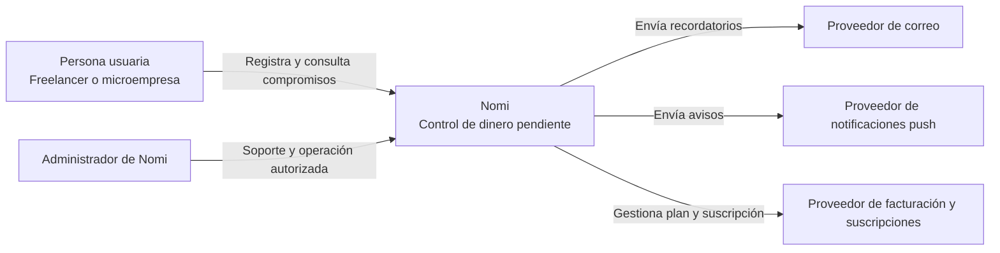
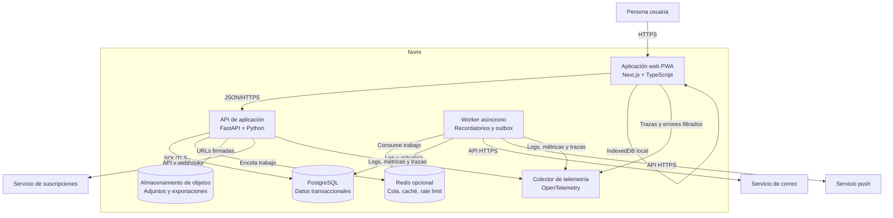
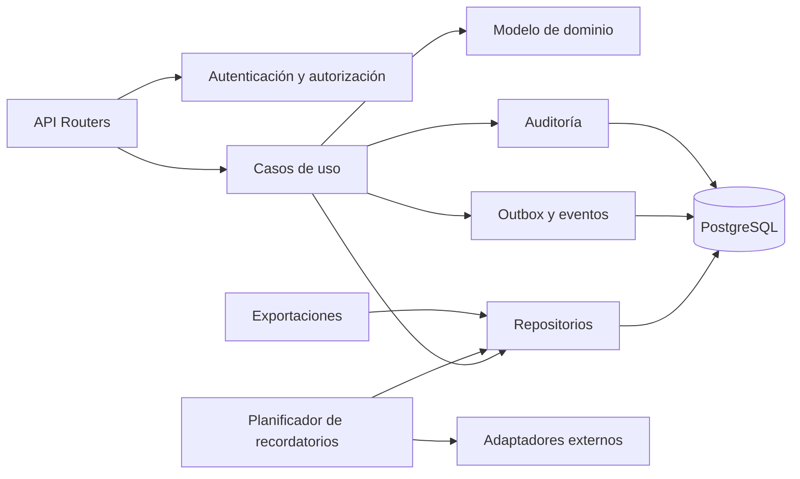
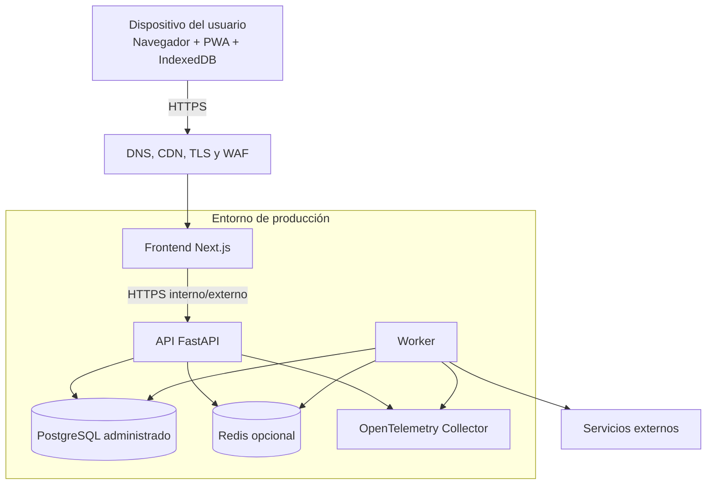
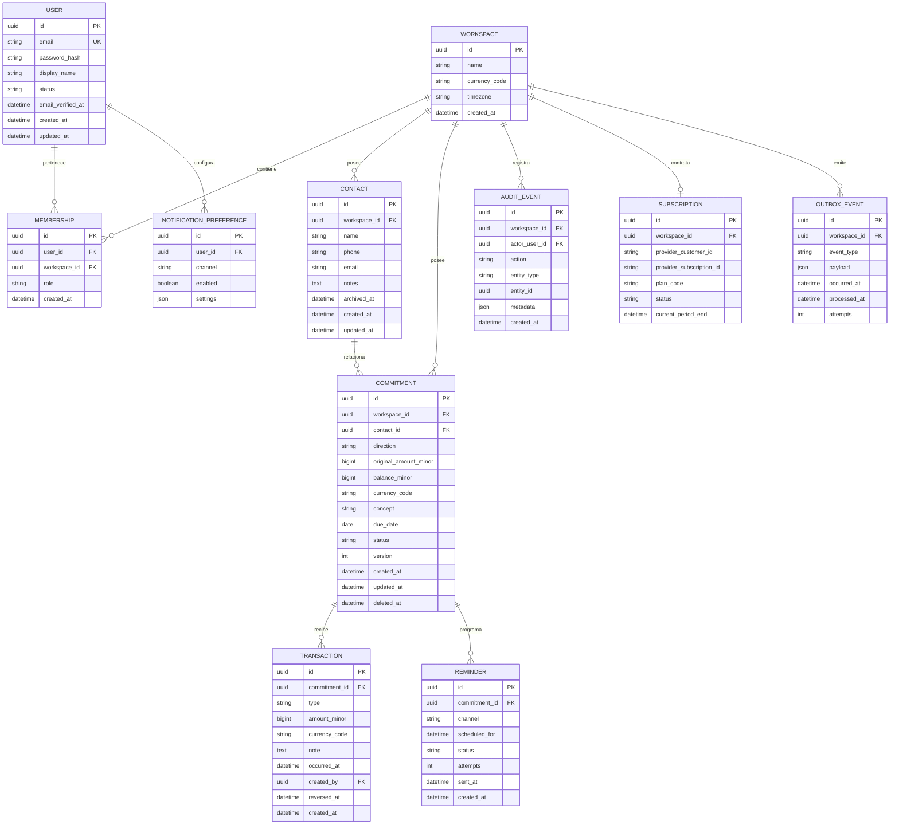

# Nomi

> La forma más simple de controlar el dinero pendiente.

**Documento maestro de producto y arquitectura**  
**Versión:** 1.0  
**Estado:** Propuesta para validación  
**Fecha:** 2 de octubre de 2026  
**Mercado inicial:** México  
**Tipo de producto:** SaaS web progresivo, mobile-first y offline-tolerant

---

## Índice

1. [Resumen ejecutivo](#1-resumen-ejecutivo)
2. [PRD](#2-prd-product-requirements-document)
3. [Alcance funcional](#3-alcance-funcional)
4. [Requisitos no funcionales](#4-requisitos-no-funcionales)
5. [Arquitectura](#5-arquitectura)
6. [Diagramas C4](#6-diagramas-c4)
7. [Modelo de dominio y ERD](#7-modelo-de-dominio-y-erd)
8. [Diseño de API](#8-diseño-de-api)
9. [Seguridad](#9-seguridad)
10. [Privacidad y datos](#10-privacidad-y-datos)
11. [Observabilidad](#11-observabilidad)
12. [Disponibilidad, respaldo y recuperación](#12-disponibilidad-respaldo-y-recuperación)
13. [Estrategia offline y sincronización](#13-estrategia-offline-y-sincronización)
14. [Monetización](#14-monetización)
15. [Roadmap](#15-roadmap)
16. [Pruebas y calidad](#16-pruebas-y-calidad)
17. [DevOps y despliegue](#17-devops-y-despliegue)
18. [Estructura del repositorio](#18-estructura-del-repositorio)
19. [ADR](#19-architecture-decision-records)
20. [Riesgos](#20-riesgos-y-mitigaciones)
21. [Definición de terminado](#21-definición-de-terminado)
22. [Referencias](#22-referencias)

---

# 1. Resumen ejecutivo

Nomi es una herramienta independiente para registrar, consultar y dar seguimiento al dinero pendiente. Permite controlar tanto cuentas por cobrar como cuentas por pagar, sin convertirse en un sistema contable, fiscal o bancario.

## 1.1 Problema

Freelancers, microempresas, comerciantes, arrendadores y personas que prestan o administran dinero suelen repartir la información entre libretas, hojas de cálculo, mensajes y memoria. Esto provoca falta de seguimiento, saldos incorrectos, vencimientos olvidados y poca claridad sobre la liquidez real.

## 1.2 Propuesta de valor

> Nomi muestra en segundos quién debe, cuánto falta, qué vence pronto y qué requiere atención.

## 1.3 Principios del producto

1. **Captura rápida:** registrar un compromiso en menos de 20 segundos.
2. **Claridad antes que complejidad:** priorizar saldos, fechas y acciones.
3. **Mobile-first:** la experiencia principal se diseña para celular.
4. **Offline-tolerant:** permitir consulta y captura básica cuando la conexión sea inestable.
5. **Portabilidad:** exportar y eliminar datos sin dependencia artificial.
6. **Privacidad por diseño:** recopilar únicamente los datos necesarios.
7. **Monolito modular:** simplicidad operativa sin perder separación de responsabilidades.

## 1.4 Límites del producto

Nomi no será, en su MVP:

- Un ERP.
- Un sistema contable o fiscal.
- Una herramienta de facturación electrónica.
- Una pasarela para transferir dinero entre usuarios.
- Un buró de crédito.
- Un CRM generalista.
- Una plataforma de cobranza agresiva.

---

# 2. PRD: Product Requirements Document

## 2.1 Objetivo

Validar si una experiencia extremadamente simple de control de pendientes mejora el seguimiento financiero de trabajadores independientes y microempresas.

## 2.2 Usuarios iniciales

### Persona A: profesional independiente

- Cobra por proyecto o anticipo.
- Maneja entre pocos y decenas de clientes activos.
- Necesita identificar saldos y vencimientos sin usar contabilidad compleja.

### Persona B: negocio con venta a crédito

- Registra ventas fiadas o pagos parciales.
- Necesita el historial por cliente.
- Opera principalmente desde el celular.

### Segmentos posteriores

- Arrendadores.
- Prestadores de servicios recurrentes.
- Personas que controlan préstamos informales.
- Equipos pequeños con roles y permisos.

## 2.3 Trabajos por realizar

- Cuando concedo crédito, quiero registrar el monto y la fecha para no depender de mi memoria.
- Cuando recibo un abono, quiero actualizar el saldo sin recalcularlo manualmente.
- Cuando abro la aplicación, quiero identificar vencidos y próximos vencimientos.
- Cuando hablo con una persona, quiero consultar su historial completo.
- Cuando cambio de herramienta, quiero descargar mis datos.

## 2.4 Hipótesis

- H1: los usuarios comprenden mejor “por cobrar” y “por pagar” que términos contables.
- H2: la captura breve incrementa el registro de movimientos.
- H3: el resumen de pendientes genera más valor que reportes complejos en la etapa inicial.
- H4: los recordatorios para el propio usuario son suficientes para validar el hábito antes de agregar mensajería a terceros.
- H5: un plan gratuito limitado puede facilitar la prueba, mientras que recordatorios, exportaciones y recurrencias pueden impulsar la conversión.

## 2.5 Objetivos medibles del piloto

Los siguientes valores son metas de producto propuestas y deben ajustarse con evidencia:

- Al menos 70% de usuarios nuevos registra el primer compromiso.
- Mediana inferior a 2 minutos desde el registro hasta el primer compromiso.
- Mediana inferior a 20 segundos para capturas posteriores.
- Al menos 30% de usuarios activados regresa la semana siguiente.
- Menos de 2% de operaciones termina con error no recuperado.
- Al menos 80% de participantes puede explicar su saldo sin ayuda durante una prueba de usabilidad.

## 2.6 Métrica principal

**Usuarios activos semanales que actualizan o consultan al menos un compromiso vigente.**

No se usará “monto cobrado” como única métrica principal porque Nomi no ejecuta necesariamente el cobro y no puede atribuirse todo el resultado.

## 2.7 Criterios de éxito del MVP

El MVP se considera validado para continuar si:

- El problema aparece de forma recurrente en las entrevistas.
- Los usuarios registran datos reales, no solo datos de prueba.
- Existe repetición semanal de consulta o actualización.
- Un subconjunto declara disposición a pagar por funciones concretas.
- El costo operativo por usuario permite un margen sostenible.

## 2.8 Historias de usuario prioritarias

### Épica: autenticación

- Como usuario, quiero crear una cuenta para sincronizar mis datos.
- Como usuario, quiero recuperar el acceso de forma segura.
- Como usuario, quiero cerrar sesiones abiertas.

### Épica: contactos

- Como usuario, quiero registrar un contacto con nombre y datos opcionales.
- Como usuario, quiero ver el saldo agregado y el historial por contacto.

### Épica: compromisos

- Como usuario, quiero registrar si me deben o si debo.
- Como usuario, quiero asignar monto, concepto y fecha límite.
- Como usuario, quiero registrar abonos y ver el saldo recalculado.
- Como usuario, quiero marcar un compromiso como pagado o cancelado.

### Épica: tablero

- Como usuario, quiero ver por cobrar, por pagar, vencido y próximos siete días.
- Como usuario, quiero filtrar por estado, dirección, contacto y fecha.

### Épica: recordatorios

- Como usuario, quiero definir cuándo recibir avisos.
- Como usuario, quiero suspender recordatorios por compromiso.

### Épica: control de datos

- Como usuario, quiero exportar mis datos.
- Como usuario, quiero solicitar la eliminación de mi cuenta.

---

# 3. Alcance funcional

## 3.1 MVP obligatorio

1. Registro, acceso, recuperación y cierre de sesión.
2. Perfil, zona horaria, moneda y preferencias básicas.
3. Contactos.
4. Compromisos por cobrar y por pagar.
5. Abonos parciales y saldo automático.
6. Estados: pendiente, parcial, por vencer, vencido, pagado y cancelado.
7. Tablero resumido.
8. Historial y bitácora de cambios esenciales.
9. Recordatorios dentro de la aplicación y por correo.
10. PWA instalable.
11. Consulta offline de información reciente.
12. Cola offline para altas y abonos.
13. Exportación CSV.
14. Eliminación de cuenta.
15. Panel administrativo interno mínimo.

## 3.2 Después del MVP

- Compromisos recurrentes.
- Archivos y comprobantes.
- Exportación PDF.
- Enlaces de estado de cuenta con expiración.
- Plantillas por perfil.
- Etiquetas y campos personalizados limitados.
- Equipos, roles y asignaciones.
- Suscripción pagada.
- Predicción de flujo basada en historial propio.

## 3.3 Fuera de alcance inicial

- Mensajes automáticos a deudores.
- Integración bancaria.
- Pagos dentro de Nomi.
- Facturación fiscal.
- Calificación crediticia compartida.
- Marketplace.
- Aplicaciones móviles nativas.
- Microservicios.

## 3.4 Reglas de negocio

- Todo registro pertenece a un `owner_id` o espacio de trabajo.
- El saldo se calcula como monto original menos movimientos aplicables.
- El saldo nunca debe ser negativo sin una operación explícita de ajuste.
- Un compromiso pagado tiene saldo cero.
- “Por vencer” es una vista calculada, no necesariamente un estado persistido.
- “Vencido” depende de la fecha límite, zona horaria y saldo mayor que cero.
- El dinero se almacena como entero en la unidad menor de la moneda.
- Cada modificación financiera genera una entrada de auditoría.
- El borrado financiero debe ser lógico durante la ventana de recuperación; después se purga según política.
- Las operaciones de creación de movimientos aceptan clave de idempotencia.

---

# 4. Requisitos no funcionales

## 4.1 Rendimiento

Metas propuestas para el MVP:

- p95 de lectura de API inferior a 500 ms, sin contar red del usuario.
- p95 de escritura inferior a 800 ms.
- carga inicial útil inferior a 3 segundos en una conexión móvil moderada.
- interacción visible en menos de 100 ms para acciones locales.
- paginación obligatoria en listados.

## 4.2 Disponibilidad

- Objetivo inicial: 99.5% mensual, excluyendo mantenimiento anunciado.
- Degradación controlada si correo, push o analítica no están disponibles.
- Los recordatorios nunca deben bloquear la captura financiera.

## 4.3 Accesibilidad

- Meta WCAG 2.2 nivel AA.
- Navegación por teclado.
- Contraste suficiente.
- Etiquetas accesibles.
- No depender exclusivamente del color para comunicar estados.
- Formatos monetarios y fechas localizados.

## 4.4 Compatibilidad

- Versiones actuales de navegadores Chromium, Safari y Firefox.
- Diseño desde 320 px de ancho.
- PWA instalable cuando el navegador lo permita.

## 4.5 Mantenibilidad

- Cobertura de pruebas centrada en reglas financieras, no en porcentaje vacío.
- Migraciones de base de datos versionadas.
- Contrato OpenAPI como fuente para el cliente tipado.
- ADR para decisiones importantes.
- Dependencias actualizadas mediante automatización y revisión.

---

# 5. Arquitectura

## 5.1 Enfoque

Nomi se construirá como un **monolito modular API-first** dentro de un monorepo. La separación será por dominios y no por capas globales gigantes.

## 5.2 Stack propuesto

### Frontend

- Next.js con App Router.
- TypeScript.
- Tailwind CSS.
- TanStack Query para estado del servidor.
- React Hook Form y Zod para formularios.
- IndexedDB mediante una capa de repositorio local.
- Service Worker para shell, caché y cola de sincronización.

### Backend

- Python.
- FastAPI.
- Pydantic.
- SQLAlchemy 2.x.
- Alembic.
- PostgreSQL.
- Redis solo cuando exista una necesidad demostrada de cola, caché o rate limiting distribuido.
- Worker para recordatorios y tareas asíncronas.

### Infraestructura

- Docker para entornos reproducibles.
- Entorno administrado para MVP.
- CDN/WAF y DNS mediante proveedor perimetral.
- Almacenamiento compatible con S3 cuando existan adjuntos.
- CI/CD con validaciones, pruebas, migraciones y despliegue controlado.

## 5.3 Módulos de dominio

- `identity`: cuentas, sesiones, verificación y recuperación.
- `workspaces`: propietario, membresía futura y preferencias.
- `contacts`: personas y organizaciones relacionadas.
- `commitments`: cuentas por cobrar y pagar.
- `transactions`: abonos, pagos y ajustes.
- `reminders`: programación y entrega.
- `reporting`: agregados, exportaciones y métricas de negocio del usuario.
- `billing`: planes, límites y suscripciones.
- `audit`: eventos de seguridad y cambios financieros.

## 5.4 Patrón interno por módulo

```text
module/
├── domain/          # entidades, valores y reglas puras
├── application/     # casos de uso y puertos
├── infrastructure/  # persistencia y adaptadores externos
└── api/             # rutas, esquemas HTTP y dependencias
```

## 5.5 Flujo de una operación

1. La interfaz valida la forma y envía una petición con `Idempotency-Key`.
2. La API autentica sesión y obtiene el espacio de trabajo.
3. El caso de uso valida autorización y reglas de negocio.
4. La transacción de base de datos escribe compromiso o movimiento.
5. Se agrega evento a una tabla outbox en la misma transacción.
6. La API devuelve el recurso actualizado.
7. Un worker procesa la outbox para recordatorios, analítica o integraciones.

---

# 6. Diagramas C4

Los diagramas están escritos con Mermaid para que puedan renderizarse en plataformas compatibles.

## 6.1 C4 Nivel 1: contexto



## 6.2 C4 Nivel 2: contenedores



## 6.3 C4 Nivel 3: componentes del backend



## 6.4 Diagrama de despliegue



---

# 7. Modelo de dominio y ERD

## 7.1 Entidades principales

- Usuario.
- Espacio de trabajo.
- Membresía.
- Contacto.
- Compromiso.
- Movimiento.
- Recordatorio.
- Preferencia de notificación.
- Evento de auditoría.
- Suscripción.
- Evento outbox.

## 7.2 ERD



## 7.3 Índices recomendados

- `commitment(workspace_id, status, due_date)`.
- `commitment(workspace_id, contact_id, created_at)`.
- `transaction(commitment_id, occurred_at)`.
- `reminder(status, scheduled_for)`.
- `audit_event(workspace_id, created_at)`.
- Índice único por `workspace_id + idempotency_key` para escrituras relevantes.
- Índices únicos para identificadores externos de suscripción.

## 7.4 Consistencia financiera

- Usar `BIGINT` en unidad monetaria menor.
- No usar `FLOAT` para dinero.
- Crear movimientos de reversión en vez de editar silenciosamente el historial.
- Actualizar saldo y movimiento dentro de una transacción.
- Usar bloqueo optimista mediante `version` para conflictos.
- Validar moneda consistente entre compromiso y movimiento.

---

# 8. Diseño de API

## 8.1 Convenciones

- Base: `/api/v1`.
- JSON UTF-8.
- Identificadores UUID.
- Fechas y horas ISO 8601 en UTC; fechas de vencimiento como `YYYY-MM-DD` con zona del espacio.
- Montos como enteros en unidad menor.
- Paginación por cursor.
- Errores con `application/problem+json`.
- Encabezado `Idempotency-Key` en escrituras financieras.
- `X-Request-ID` para correlación.
- Versionado mayor en URL.

## 8.2 Autenticación

Para la aplicación web se recomienda sesión segura en cookie `HttpOnly`, `Secure` y `SameSite`, con protección CSRF. Si se habilitan clientes móviles o integraciones futuras, se podrá agregar OAuth 2.1/OIDC con tokens de corta duración.

## 8.3 Recursos y endpoints

```text
POST   /api/v1/auth/register
POST   /api/v1/auth/login
POST   /api/v1/auth/logout
POST   /api/v1/auth/refresh
POST   /api/v1/auth/password/forgot
POST   /api/v1/auth/password/reset
GET    /api/v1/me
PATCH  /api/v1/me
DELETE /api/v1/me

GET    /api/v1/contacts
POST   /api/v1/contacts
GET    /api/v1/contacts/{contact_id}
PATCH  /api/v1/contacts/{contact_id}
DELETE /api/v1/contacts/{contact_id}
GET    /api/v1/contacts/{contact_id}/summary

GET    /api/v1/commitments
POST   /api/v1/commitments
GET    /api/v1/commitments/{commitment_id}
PATCH  /api/v1/commitments/{commitment_id}
DELETE /api/v1/commitments/{commitment_id}
POST   /api/v1/commitments/{commitment_id}/transactions
GET    /api/v1/commitments/{commitment_id}/transactions
POST   /api/v1/transactions/{transaction_id}/reverse

GET    /api/v1/dashboard/summary
GET    /api/v1/reminders
PATCH  /api/v1/reminders/{reminder_id}
GET    /api/v1/exports
POST   /api/v1/exports
GET    /api/v1/audit-events

GET    /api/v1/billing/plan
POST   /api/v1/billing/checkout-session
POST   /api/v1/billing/customer-portal
POST   /api/v1/webhooks/billing

GET    /health/live
GET    /health/ready
```

## 8.4 Ejemplo: crear compromiso

```http
POST /api/v1/commitments HTTP/1.1
Content-Type: application/json
Idempotency-Key: 4da64cb7-3300-44a2-9035-a8ec15204ee0
```

```json
{
  "contact_id": "ad15d2c6-51d4-44cd-b83a-d90abf73fcf1",
  "direction": "receivable",
  "original_amount_minor": 125000,
  "currency_code": "MXN",
  "concept": "Diseño de identidad",
  "due_date": "2026-10-20",
  "notes": "Segundo pago del proyecto"
}
```

```json
{
  "id": "bbbdd797-864a-4998-bec5-4944a136dbf3",
  "direction": "receivable",
  "original_amount_minor": 125000,
  "balance_minor": 125000,
  "currency_code": "MXN",
  "status": "pending",
  "due_date": "2026-10-20",
  "version": 1
}
```

## 8.5 Ejemplo de error

```json
{
  "type": "https://docs.nomi.app/problems/insufficient-balance",
  "title": "El movimiento excede el saldo",
  "status": 422,
  "detail": "El abono no puede superar el saldo pendiente.",
  "instance": "/api/v1/commitments/bbbdd797/transactions",
  "request_id": "req_01J..."
}
```

## 8.6 Esqueleto OpenAPI

```yaml
openapi: 3.1.0
info:
  title: Nomi API
  version: 1.0.0
  description: API para controlar compromisos por cobrar y por pagar.
servers:
  - url: https://api.nomi.app/api/v1
security:
  - cookieAuth: []
paths:
  /commitments:
    get:
      operationId: listCommitments
      parameters:
        - in: query
          name: direction
          schema:
            type: string
            enum: [receivable, payable]
        - in: query
          name: status
          schema:
            type: string
        - in: query
          name: cursor
          schema:
            type: string
      responses:
        "200":
          description: Lista paginada
    post:
      operationId: createCommitment
      parameters:
        - in: header
          name: Idempotency-Key
          required: true
          schema:
            type: string
            format: uuid
      requestBody:
        required: true
        content:
          application/json:
            schema:
              $ref: "#/components/schemas/CommitmentCreate"
      responses:
        "201":
          description: Compromiso creado
components:
  securitySchemes:
    cookieAuth:
      type: apiKey
      in: cookie
      name: nomi_session
  schemas:
    CommitmentCreate:
      type: object
      required: [contact_id, direction, original_amount_minor, currency_code]
      properties:
        contact_id: { type: string, format: uuid }
        direction: { type: string, enum: [receivable, payable] }
        original_amount_minor: { type: integer, minimum: 1 }
        currency_code: { type: string, pattern: "^[A-Z]{3}$" }
        concept: { type: string, maxLength: 160 }
        due_date: { type: [string, "null"], format: date }
```

## 8.7 Webhooks de facturación

- Verificar firma antes de procesar.
- Guardar `event_id` único para evitar duplicados.
- Responder rápido y procesar después mediante outbox/cola.
- No confiar en datos del frontend para habilitar planes.
- Mantener una proyección local del estado de suscripción.

---

# 9. Seguridad

## 9.1 Estándar objetivo

Usar OWASP ASVS nivel 2 como referencia de requisitos para la aplicación, ya que manejará datos personales y financieros declarados por el usuario. Esto no equivale a una certificación automática.

## 9.2 Modelo de amenazas resumido

| Amenaza | Ejemplo | Control principal |
|---|---|---|
| Suplantación | robo de sesión | cookies seguras, rotación, MFA futuro |
| Manipulación | alterar abonos | autorización por objeto, auditoría, validación |
| Repudio | negar un cambio | bitácora inmutable lógica y correlación |
| Divulgación | fuga entre usuarios | aislamiento por workspace y pruebas negativas |
| Denegación | abuso de endpoints | rate limiting, cuotas y degradación |
| Elevación | usuario obtiene rol admin | RBAC, mínimo privilegio y revisión |

## 9.3 Autenticación

- Contraseñas con Argon2id mediante biblioteca mantenida.
- Política basada en longitud y bloqueo de contraseñas conocidas, no reglas arbitrarias excesivas.
- Verificación de correo.
- Recuperación con token de un solo uso, corto y almacenado de forma segura.
- Sesiones revocables.
- Rotación al autenticar y cambiar privilegios.
- Invalidación tras cambio de contraseña.
- MFA opcional después del MVP y obligatorio para cuentas administrativas.

## 9.4 Autorización

- Denegar por defecto.
- Verificar `workspace_id` dentro de cada consulta.
- No aceptar `owner_id` del cliente como autoridad.
- RBAC inicial: `owner`, `member`, `support_admin`.
- El rol de soporte no debe ver datos financieros salvo acceso temporal, justificado y auditado.
- Pruebas automáticas contra IDOR/BOLA.

## 9.5 Seguridad de sesión y navegador

- Cookies `HttpOnly`, `Secure` y `SameSite=Lax` o `Strict` según flujo.
- Protección CSRF para operaciones mutables.
- CSP estricta y sin `unsafe-inline` cuando sea viable.
- HSTS.
- `X-Content-Type-Options: nosniff`.
- Política de `Referrer-Policy` restrictiva.
- `Permissions-Policy` mínima.
- CORS con orígenes explícitos.
- Sanitización de contenido mostrado.

## 9.6 API y validación

- Esquemas de entrada y respuesta explícitos.
- Límite de tamaño para cuerpo y archivos.
- Consultas parametrizadas por ORM.
- Rate limiting diferenciado para login, recuperación y exportación.
- Idempotencia en movimientos y webhooks.
- No exponer trazas internas al cliente.
- Documentación OpenAPI pública o privada según estrategia, nunca como sustituto de controles.

## 9.7 Protección de datos

- TLS en tránsito.
- Cifrado de discos y respaldos mediante el proveedor.
- Secretos fuera del repositorio.
- Rotación de credenciales.
- Minimizar teléfonos y correos de terceros.
- No registrar importes, nombres, correos, teléfonos, tokens o cuerpos completos en logs.
- Exportaciones con URL firmada de corta duración.

## 9.8 Seguridad operativa

- Dependabot/Renovate y escaneo de dependencias.
- SAST, análisis de secretos y escaneo de imágenes de contenedor.
- SBOM en builds de producción.
- Imágenes fijadas por digest cuando sea posible.
- Usuarios de contenedor sin privilegios.
- Separación de ambientes y credenciales.
- Revisión de migraciones antes de producción.
- Prueba de restauración periódica.

## 9.9 Respuesta a incidentes

1. Detectar y clasificar.
2. Contener credenciales, sesiones o despliegues afectados.
3. Preservar evidencia técnica sin exponer datos adicionales.
4. Erradicar causa raíz.
5. Restaurar servicio y verificar integridad.
6. Comunicar conforme a obligaciones aplicables.
7. Elaborar postmortem sin culpabilizar y registrar acciones.

---

# 10. Privacidad y datos

> Esta sección es una guía de diseño y no sustituye asesoría legal en México.

## 10.1 Categorías de datos

- Cuenta: nombre, correo, credenciales derivadas.
- Configuración: moneda, zona horaria y preferencias.
- Terceros: nombre, teléfono o correo opcional de contactos.
- Finanzas declaradas: montos, conceptos, fechas y saldos.
- Técnica: IP reducida o temporal, agente, eventos de seguridad y errores.
- Facturación: identificadores del proveedor, sin almacenar datos completos de tarjeta.

## 10.2 Principios

- Finalidad específica.
- Minimización.
- Retención limitada.
- Acceso restringido.
- Portabilidad.
- Eliminación verificable.
- Transparencia en analítica y comunicaciones.

## 10.3 Retención propuesta

- Datos activos: mientras exista la cuenta.
- Cuenta eliminada: ventana breve de recuperación y purga posterior documentada.
- Backups: retención limitada y expiración automática.
- Logs operativos: ventana corta apropiada para diagnóstico.
- Auditoría de seguridad: retención mayor basada en riesgo y obligación.
- Exportaciones: eliminación automática después de su expiración.

Las duraciones exactas deben aprobarse legal y operativamente antes del lanzamiento.

---

# 11. Observabilidad

## 11.1 Objetivos

- Detectar fallas antes de que se conviertan en incidentes mayores.
- Correlacionar frontend, API, worker y base de datos.
- Medir experiencia sin registrar datos financieros sensibles.
- Separar telemetría operativa de analítica de producto.

## 11.2 Estándar

Usar OpenTelemetry para trazas, métricas y logs estructurados, exportados mediante OTLP hacia un proveedor intercambiable.

## 11.3 Logs

Formato JSON con:

```json
{
  "timestamp": "2026-10-02T15:30:00Z",
  "level": "INFO",
  "service": "nomi-api",
  "environment": "production",
  "request_id": "req_01J...",
  "trace_id": "a1b2...",
  "route": "/api/v1/commitments",
  "method": "POST",
  "status_code": 201,
  "duration_ms": 142
}
```

Nunca registrar:

- Contraseñas.
- Tokens.
- Cookies.
- Números completos de tarjeta.
- Cuerpos financieros completos.
- Nombres, teléfonos o correos sin necesidad y tratamiento.

## 11.4 Métricas técnicas

- Tasa de solicitudes.
- p50, p95 y p99 de latencia.
- Porcentaje de errores por ruta.
- Conexiones y latencia de PostgreSQL.
- Trabajo pendiente y antigüedad de la cola.
- Recordatorios enviados, fallidos y reintentados.
- Éxito y duración de respaldos.
- Sincronizaciones offline exitosas y en conflicto.
- Disponibilidad de dependencias externas.

## 11.5 Métricas de producto

- Activación.
- Primer compromiso creado.
- Usuarios activos semanales.
- Compromisos activos por usuario.
- Abonos registrados.
- Recordatorios configurados.
- Exportaciones solicitadas.
- Conversión por plan.
- Cancelación y recuperación de suscripciones.

No mezclar métricas de producto con registros de seguridad ni capturar conceptos financieros en analítica.

## 11.6 SLI, SLO y alertas

### SLI

- Disponibilidad de API.
- Latencia p95.
- tasa de errores 5xx.
- retraso de recordatorios.
- éxito de sincronización.

### SLO iniciales propuestos

- API disponible 99.5% por mes.
- 95% de lecturas bajo 500 ms.
- 99% de recordatorios procesados dentro de una ventana de 15 minutos respecto a su programación, sin garantizar entrega del proveedor.

### Alertas

- Quemado acelerado del presupuesto de error.
- Error 5xx sostenido.
- Cola con antigüedad creciente.
- Réplica o respaldo fallido.
- Espacio de base de datos bajo.
- Aumento anómalo en fallos de login.

## 11.7 Tableros

1. **Producto:** activación, retención y uso.
2. **API:** tráfico, latencia, errores y saturación.
3. **Worker:** colas, reintentos, fallos y retraso.
4. **Base de datos:** consultas, conexiones, bloqueos y almacenamiento.
5. **Seguridad:** autenticaciones fallidas, cambios de privilegio y exportaciones.
6. **Facturación:** altas, cancelaciones, pagos fallidos y webhooks.

---

# 12. Disponibilidad, respaldo y recuperación

## 12.1 Estrategia

- PostgreSQL administrado con copias automáticas.
- Respaldos cifrados.
- Restauración ensayada, no solo respaldo configurado.
- Exportación lógica adicional antes de migraciones de alto riesgo.
- Infraestructura documentada como código cuando el producto lo justifique.

## 12.2 Objetivos iniciales propuestos

- RPO: hasta 24 horas en alfa; reducir antes de comercialización.
- RTO: hasta 8 horas en alfa; reducir antes del lanzamiento pagado.

Los objetivos deben revisarse con costos, volumen y promesa comercial.

## 12.3 Salud

- `live`: proceso vivo, sin probar dependencias.
- `ready`: servicio listo y dependencias críticas disponibles.
- No incluir secretos o detalles internos en respuestas públicas.

---

# 13. Estrategia offline y sincronización

## 13.1 Alcance offline

- Consultar tablero y registros previamente sincronizados.
- Crear contactos y compromisos.
- Registrar abonos.
- Mostrar claramente el estado “pendiente de sincronizar”.

## 13.2 No prometer en offline inicial

- Exportaciones.
- Gestión de suscripción.
- Recuperación de contraseña.
- Procesamiento de recordatorios en servidor.
- Resolución automática de todos los conflictos.

## 13.3 Diseño

- IndexedDB como almacenamiento local.
- Identificadores UUID generados en cliente.
- Cola durable de operaciones.
- Idempotency key por operación.
- Marca de versión para control optimista.
- Sincronización al recuperar conectividad.

## 13.4 Conflictos

- Cambios no financieros simples: última escritura con advertencia o fusión por campo.
- Movimientos financieros: no sobrescribir; crear operación nueva o solicitar resolución.
- Eliminación concurrente: bloquear operación y presentar estado actual.
- Registrar telemetría anónima del tipo de conflicto.

---

# 14. Monetización

## 14.1 Principio

Cobrar por valor sostenido y reducción de fricción, no por retener datos. Exportar y eliminar siempre deben estar disponibles.

## 14.2 Modelo recomendado para validar

### Gratis

- Un usuario.
- Límite de compromisos activos.
- Panel y abonos.
- Recordatorios dentro de la app.
- Exportación CSV básica.

### Nomi Plus

- Compromisos activos ampliados o ilimitados bajo uso razonable.
- Recordatorios por correo y push.
- Recurrentes.
- PDF y personalización.
- Historial y filtros avanzados.
- Respaldo/exportación ampliada.

### Nomi Negocio, posterior

- Varios miembros.
- Roles.
- Auditoría visible.
- Sucursales o espacios adicionales.
- Soporte prioritario.

## 14.3 Estrategia de precio

No fijar el precio únicamente con base en competidores. Ejecutar:

1. Entrevistas de disposición a pagar.
2. Página de precios con prueba de interés.
3. Prueba A/B o cohortes con rangos de precio.
4. Medición de conversión, cancelación y soporte.
5. Revisión de margen después de comisiones, correo, almacenamiento y soporte.

Un rango inicial puede formularse como hipótesis, pero no debe declararse definitivo antes de la investigación.

## 14.4 Facturación

- Usar checkout alojado y portal del proveedor.
- No almacenar tarjetas.
- Sincronizar suscripción mediante webhooks verificados.
- Periodo de gracia ante pago fallido.
- No borrar datos por un pago fallido.
- Degradar funciones premium de forma clara y reversible.
- Precios en MXN para el mercado inicial cuando el proveedor lo permita.

## 14.5 Métricas comerciales

- Conversión de activado a pagado.
- MRR.
- ARPU.
- Cancelación voluntaria e involuntaria.
- Recuperación de pagos fallidos.
- Margen bruto.
- Costo de soporte por cuenta.
- Tiempo hasta primer valor.

## 14.6 Experimentos

- Límite por compromisos activos vs. límite por recordatorios.
- Prueba gratuita temporal vs. freemium.
- Mensual vs. anual con descuento.
- Paquete individual vs. negocio.
- Precio mostrado después del primer valor vs. desde el inicio.

---

# 15. Roadmap

## Fase 0: descubrimiento, 2 semanas

### Actividades

- 15 a 20 entrevistas.
- Mapeo del proceso actual.
- Prueba de vocabulario.
- Identificación de riesgos de privacidad.
- Prueba de disposición a pagar.

### Entregables

- Problema validado o reformulado.
- Perfiles prioritarios.
- Journey actual.
- Lista de hipótesis.
- Criterios de descarte.

### Puerta de decisión

No construir si el dolor es poco frecuente, no se registran datos reales o el valor depende totalmente de enviar mensajes a terceros.

## Fase 1: prototipo y UX, 2 semanas

- Arquitectura de información.
- Flujos de registro, captura, abono y consulta.
- Prototipo móvil.
- Cinco pruebas de usabilidad.
- Diseño accesible inicial.

## Fase 2: cimientos técnicos, 2 semanas

- Monorepo.
- CI.
- Configuración por ambiente.
- Base de datos y migraciones.
- Autenticación.
- Observabilidad mínima.
- Threat model.

## Fase 3: núcleo financiero, 3 semanas

- Contactos.
- Compromisos.
- Movimientos.
- Reglas de saldo.
- Auditoría.
- Pruebas de dominio.
- Dashboard API.

## Fase 4: experiencia PWA, 3 semanas

- Interfaz mobile-first.
- Formularios rápidos.
- Listados y filtros.
- IndexedDB.
- Cola de sincronización.
- Instalación PWA.

## Fase 5: recordatorios y exportación, 2 semanas

- Programación.
- Worker.
- Correo.
- Preferencias.
- CSV.
- Reintentos y dead-letter handling.

## Fase 6: hardening, 2 semanas

- Pruebas de autorización.
- CSP y seguridad de navegador.
- Rate limiting.
- Revisión de logs.
- Restauración de respaldo.
- Accesibilidad.
- Rendimiento.

## Fase 7: beta cerrada, 3 a 4 semanas

- 20 a 40 usuarios.
- Soporte cercano.
- Telemetría.
- Entrevistas de seguimiento.
- Corrección de fricción y errores.

## Fase 8: monetización piloto, 2 semanas

- Catálogo de planes.
- Checkout.
- Portal.
- Webhooks.
- Periodo de gracia.
- Métricas comerciales.

## Fase 9: lanzamiento controlado

- Landing.
- Términos y privacidad revisados.
- Runbooks.
- Alertas.
- Soporte.
- Comunicación de incidentes.

---

# 16. Pruebas y calidad

## 16.1 Pirámide

- Unitarias: reglas de saldo, estados, permisos y fechas.
- Integración: repositorios, transacciones, migraciones y outbox.
- Contrato: OpenAPI y cliente generado.
- E2E: alta, login, compromiso, abono, offline y exportación.
- Seguridad: autorización por objeto, sesión, CSRF y rate limiting.
- Rendimiento: endpoints de tablero y listados.
- Accesibilidad: automatizada más revisión manual.

## 16.2 Casos críticos

- Dos abonos concurrentes.
- Reintento de la misma solicitud.
- Abono superior al saldo.
- Reversión.
- Cambio de fecha al cruzar zona horaria.
- Usuario intenta consultar otro workspace.
- Webhook duplicado o fuera de orden.
- Captura offline sincronizada dos veces.
- Eliminación mientras existan operaciones en cola.

## 16.3 Calidad en CI

- Formato y lint.
- Tipos.
- Pruebas.
- Migraciones verificadas.
- Escaneo de secretos.
- SAST.
- Vulnerabilidades de dependencias.
- Build de contenedores.
- Generación y comparación de OpenAPI.

---

# 17. DevOps y despliegue

## 17.1 Ambientes

- Local.
- Preview por pull request cuando sea viable.
- Staging con datos sintéticos.
- Producción.

Nunca copiar datos personales de producción a staging.

## 17.2 Pipeline

```mermaid
flowchart LR
    PR[Pull Request] --> CHECK[Lint, tipos y pruebas]
    CHECK --> SEC[Secretos, SAST y dependencias]
    SEC --> BUILD[Build reproducible]
    BUILD --> STAGE[Despliegue a staging]
    STAGE --> SMOKE[Smoke tests]
    SMOKE --> APPROVE[Aprobación]
    APPROVE --> MIGRATE[Migración compatible]
    MIGRATE --> PROD[Despliegue gradual]
    PROD --> VERIFY[Verificación y rollback]
```



## 17.3 Migraciones seguras

- Expandir antes de contraer.
- Cambios compatibles con versión anterior durante despliegue.
- Evitar migraciones largas dentro de la liberación.
- Respaldar y ensayar operaciones destructivas.
- Separar backfill de cambio de esquema.

## 17.4 Rollback

- Conservar imagen anterior.
- Usar feature flags para cambios riesgosos.
- No asumir que una migración destructiva puede revertirse.
- Documentar rollback de aplicación y forward-fix de datos.

---

# 18. Estructura del repositorio

```text
nomi/
├── README.md
├── LICENSE
├── CONTRIBUTING.md
├── SECURITY.md
├── CODEOWNERS
├── .editorconfig
├── .gitignore
├── .env.example
├── docker-compose.yml
├── Makefile
├── pyproject.toml
├── package.json
├── pnpm-workspace.yaml
│
├── apps/
│   ├── web/
│   │   ├── src/
│   │   │   ├── app/
│   │   │   ├── components/
│   │   │   ├── features/
│   │   │   │   ├── auth/
│   │   │   │   ├── contacts/
│   │   │   │   ├── commitments/
│   │   │   │   ├── dashboard/
│   │   │   │   ├── reminders/
│   │   │   │   └── billing/
│   │   │   ├── lib/
│   │   │   ├── offline/
│   │   │   ├── telemetry/
│   │   │   └── types/
│   │   ├── public/
│   │   ├── tests/
│   │   └── package.json
│   │
│   ├── api/
│   │   ├── app/
│   │   │   ├── core/
│   │   │   │   ├── config.py
│   │   │   │   ├── database.py
│   │   │   │   ├── security.py
│   │   │   │   ├── telemetry.py
│   │   │   │   └── errors.py
│   │   │   ├── modules/
│   │   │   │   ├── identity/
│   │   │   │   ├── workspaces/
│   │   │   │   ├── contacts/
│   │   │   │   ├── commitments/
│   │   │   │   ├── transactions/
│   │   │   │   ├── reminders/
│   │   │   │   ├── reporting/
│   │   │   │   ├── billing/
│   │   │   │   └── audit/
│   │   │   ├── shared/
│   │   │   └── main.py
│   │   ├── alembic/
│   │   ├── tests/
│   │   └── Dockerfile
│   │
│   └── worker/
│       ├── app/
│       ├── tests/
│       └── Dockerfile
│
├── packages/
│   ├── api-client/          # cliente generado desde OpenAPI
│   ├── ui/                  # componentes compartidos
│   ├── config/              # lint, TypeScript y estilos
│   └── schemas/             # esquemas compartidos no sensibles
│
├── docs/
│   ├── product/
│   │   ├── prd.md
│   │   ├── roadmap.md
│   │   └── personas.md
│   ├── architecture/
│   │   ├── c4.md
│   │   ├── erd.md
│   │   ├── security.md
│   │   └── observability.md
│   ├── api/
│   │   └── openapi.yaml
│   ├── runbooks/
│   │   ├── incident.md
│   │   ├── restore-backup.md
│   │   └── failed-reminders.md
│   └── adr/
│       ├── 0001-modular-monolith.md
│       ├── 0002-postgresql.md
│       ├── 0003-fastapi.md
│       ├── 0004-nextjs-pwa.md
│       ├── 0005-session-auth.md
│       ├── 0006-outbox.md
│       ├── 0007-opentelemetry.md
│       └── 0008-hosted-billing.md
│
├── infrastructure/
│   ├── docker/
│   ├── environments/
│   ├── monitoring/
│   └── scripts/
│
└── .github/
    ├── workflows/
    ├── ISSUE_TEMPLATE/
    └── pull_request_template.md
```

---

# 19. Architecture Decision Records

## ADR-0001: monolito modular

**Estado:** aceptado.  
**Contexto:** equipo pequeño, dominio en validación y necesidad de iterar rápido.  
**Decisión:** una aplicación backend desplegable con módulos de dominio separados.  
**Consecuencias positivas:** menor costo operativo, transacciones simples y depuración directa.  
**Consecuencias negativas:** exige disciplina para evitar acoplamiento.  
**Revisión:** cuando escalamiento o autonomía de equipos justifique separar un módulo.

## ADR-0002: PostgreSQL

**Estado:** aceptado.  
**Decisión:** PostgreSQL como fuente de verdad.  
**Motivo:** transacciones, relaciones, restricciones, agregados y madurez.  
**Alternativas:** MongoDB y bases serverless propietarias.  
**Consecuencia:** se requiere diseñar migraciones y operación de base de datos.

## ADR-0003: FastAPI

**Estado:** aceptado con validación técnica temprana.  
**Decisión:** FastAPI para la API.  
**Motivo:** Python tipado, Pydantic y generación OpenAPI.  
**Riesgo:** fragmentar autenticación y administración con demasiadas bibliotecas.  
**Mitigación:** seleccionar pocas dependencias, encapsular identidad y mantener pruebas de seguridad.

## ADR-0004: Next.js PWA

**Estado:** aceptado.  
**Decisión:** Next.js con TypeScript como interfaz y PWA.  
**Motivo:** una base web instalable, rutas modernas y ecosistema.  
**Riesgo:** complejidad de caché y actualizaciones del Service Worker.  
**Mitigación:** estrategia explícita de caché y mensajes de actualización.

## ADR-0005: sesión en cookie para web

**Estado:** aceptado.  
**Decisión:** sesión opaca o tokens gestionados en cookie segura, no tokens persistidos en `localStorage`.  
**Motivo:** reducir exposición frente a robo mediante JavaScript.  
**Consecuencia:** implementar CSRF y ciclo de sesión correcto.

## ADR-0006: outbox transaccional

**Estado:** aceptado.  
**Decisión:** escribir eventos de integración en la misma transacción que el cambio de negocio.  
**Motivo:** evitar pérdida entre persistencia y envío a worker.  
**Consecuencia:** proceso de reintentos, idempotencia y limpieza.

## ADR-0007: OpenTelemetry

**Estado:** aceptado.  
**Decisión:** instrumentación neutral mediante OpenTelemetry y OTLP.  
**Motivo:** correlación de servicios y flexibilidad de proveedor.  
**Consecuencia:** controlar cardinalidad, costo y datos sensibles.

## ADR-0008: facturación alojada

**Estado:** propuesto.  
**Decisión:** checkout y portal alojados por proveedor.  
**Motivo:** reducir exposición a datos de pago y acelerar validación.  
**Consecuencia:** dependencia comercial que debe aislarse detrás de un adaptador.

## ADR-0009: dinero como entero

**Estado:** aceptado.  
**Decisión:** almacenar importes en unidades menores como entero y código ISO de moneda.  
**Motivo:** evitar errores binarios de punto flotante.  
**Consecuencia:** formateo y redondeo explícito en límites de sistema.

## ADR-0010: no microservicios en MVP

**Estado:** aceptado.  
**Decisión:** no separar servicios por anticipación.  
**Disparadores para reconsiderar:** necesidades independientes de escalado, límites organizacionales claros, aislamiento regulatorio o despliegues conflictivos frecuentes.

---

# 20. Riesgos y mitigaciones

| Riesgo | Impacto | Mitigación |
|---|---|---|
| Producto demasiado genérico | baja adopción | usuario ancla y lenguaje validado |
| Complejidad offline | errores de saldo | alcance limitado, idempotencia y conflictos explícitos |
| Fuga entre cuentas | crítico | aislamiento por workspace y pruebas negativas |
| Recordatorios no entregados | pérdida de confianza | estados, reintentos y mensaje de no garantía |
| Sobreingeniería | retraso | puertas de decisión y MVP estricto |
| Dependencia de proveedores | costo o bloqueo | adaptadores y exportación de datos |
| Datos incorrectos del usuario | decisiones equivocadas | historial, reversión y confirmaciones claras |
| Nombre o marca no disponibles | retrabajo | búsqueda legal, dominio y marca antes del lanzamiento |
| Costos de telemetría | margen reducido | muestreo, retención y control de cardinalidad |
| Monetización prematura | mala conversión | validar valor y disposición a pagar primero |

---

# 21. Definición de terminado

Una funcionalidad está terminada cuando:

- Tiene criterios de aceptación cumplidos.
- Incluye pruebas apropiadas.
- Autoriza por objeto y workspace.
- No filtra datos sensibles en logs.
- Actualiza OpenAPI si corresponde.
- Incluye telemetría útil y limitada.
- Cumple accesibilidad básica.
- Funciona en móvil.
- Maneja carga, error y estado vacío.
- Considera offline cuando aplique.
- Tiene migración reversible o estrategia de forward-fix.
- Está documentada.
- Pasó revisión de código.
- Está desplegada en staging y supera smoke tests.

---

# 22. Referencias

Estas referencias respaldan decisiones generales. Las selecciones finales deben verificarse de nuevo al iniciar la implementación.

- Next.js, guía oficial de PWA: https://nextjs.org/docs/app/guides/progressive-web-apps
- Next.js, guía oficial de OpenTelemetry: https://nextjs.org/docs/app/guides/open-telemetry
- FastAPI, documentación y compatibilidad con OpenAPI/JSON Schema: https://fastapi.tiangolo.com/
- FastAPI, extensión de OpenAPI: https://fastapi.tiangolo.com/how-to/extending-openapi/
- OWASP ASVS: https://owasp.org/www-project-application-security-verification-standard
- OWASP Logging Cheat Sheet: https://cheatsheetseries.owasp.org/cheatsheets/Logging_Cheat_Sheet.html
- C4 Model, diagramas: https://c4model.com/diagrams
- Stripe Billing, suscripciones: https://stripe.com/mx/billing/subscriptions
- Stripe Billing, tarifas: https://stripe.com/mx/billing/pricing

---

## Nota final

Este documento es una memoria técnica y de producto para orientar validación, diseño e implementación. Las metas numéricas de disponibilidad, rendimiento, retención, recuperación y monetización son hipótesis iniciales, no garantías comerciales. Antes del lanzamiento deben revisarse el nombre y la marca, la privacidad, los términos, el tratamiento de datos de terceros, la fiscalidad de las suscripciones y las obligaciones aplicables en México.
