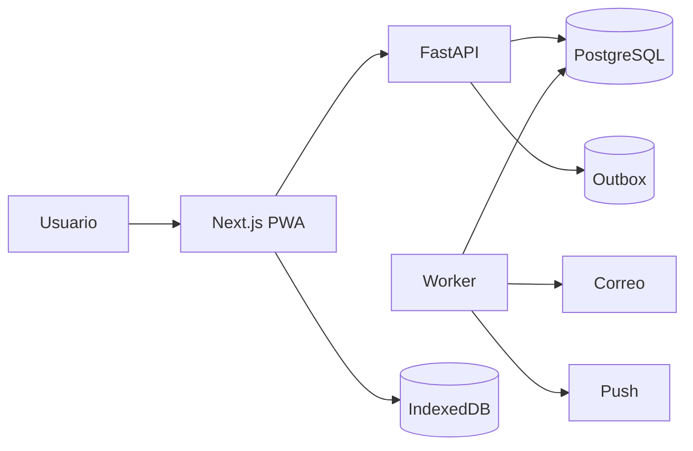

# Arquitectura general

## Estilo

Nomi se implementa como **monolito modular API-first en monorepo**.

Esto significa:

- un backend desplegable principal;
- una base de datos transaccional;
- módulos internos con límites explícitos;
- API como contrato entre frontend y backend;
- worker separado sólo para trabajo asíncrono cuando sea necesario;
- cero microservicios anticipados.

## Razón

El dominio aún está validándose. Un equipo pequeño necesita:

- transacciones simples;
- depuración directa;
- despliegue económico;
- velocidad de iteración;
- capacidad de separar módulos más adelante sólo si existe evidencia.

## Stack objetivo

### Frontend

- Next.js App Router;
- TypeScript;
- Tailwind CSS;
- TanStack Query;
- React Hook Form;
- Zod;
- IndexedDB detrás de una capa de repositorio local;
- Service Worker para shell/cache/cola.

### Backend

- Python;
- FastAPI;
- Pydantic;
- SQLAlchemy 2.x;
- Alembic;
- PostgreSQL;
- worker asíncrono;
- Redis sólo cuando exista una necesidad demostrada.

### Infraestructura

- Docker;
- entorno administrado para MVP;
- CDN/WAF/DNS perimetral;
- almacenamiento S3-compatible cuando existan adjuntos;
- CI/CD;
- OpenTelemetry.

## Topología



## Principio de dependencia

Las dependencias apuntan hacia el dominio:

```text
API / Infrastructure
        ↓
Application
        ↓
Domain
```

El dominio no importa FastAPI, SQLAlchemy, proveedor de correo ni detalles de despliegue.

## Regla de modificación

> Un módulo no modifica directamente las tablas propiedad de otro módulo.

Cuando una operación cruza módulos:

- se usa un caso de uso orquestador;
- o se publica un evento/outbox para efectos secundarios.

## Fuentes de verdad

- **PostgreSQL**: verdad transaccional.
- **Commitment.balance_minor**: saldo materializado y protegido por reglas.
- **Transaction**: explicación histórica del cambio.
- **Dashboard**: proyección/consulta, no fuente de verdad.
- **IndexedDB**: cache/cola local, nunca autoridad final.
