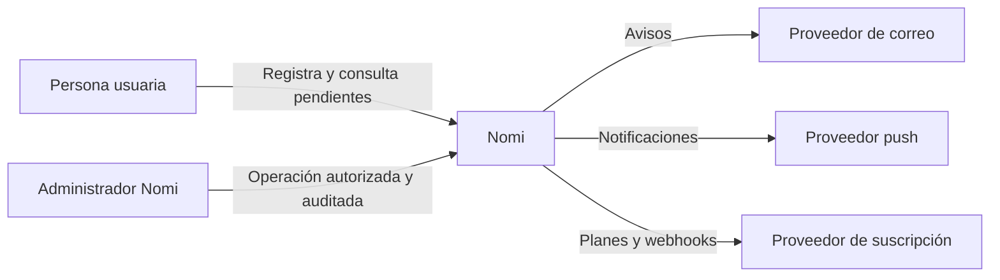
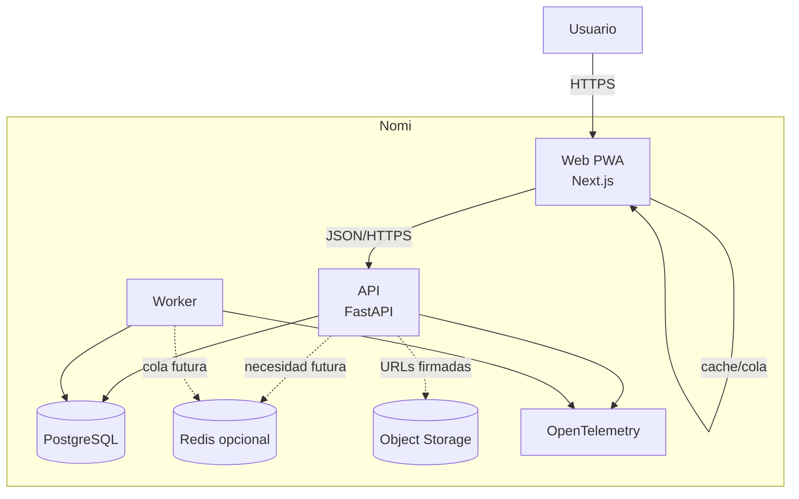
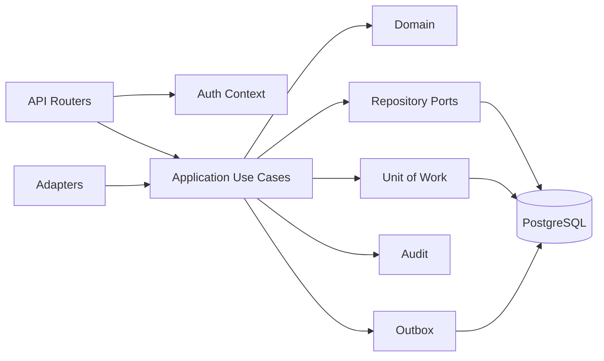
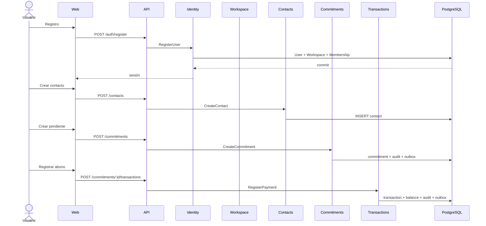
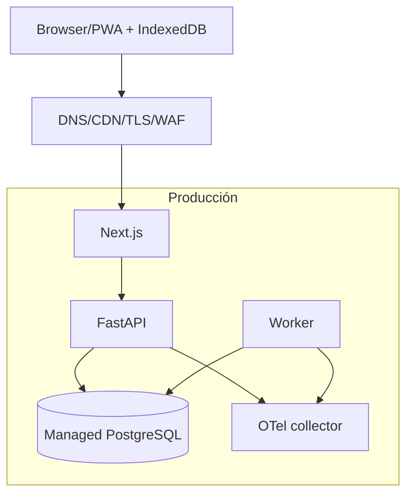

# Diagramas C4 y despliegue

## Nivel 1 — Contexto

```mermaid
flowchart LR
    USER[Persona usuaria]
    ADMIN[Administrador Nomi]
    NOMI[Nomi]
    EMAIL[Proveedor de correo]
    PUSH[Proveedor push]
    BILL[Proveedor de suscripción]

    USER -->|Registra y consulta pendientes| NOMI
    ADMIN -->|Operación autorizada y auditada| NOMI
    NOMI -->|Avisos| EMAIL
    NOMI -->|Notificaciones| PUSH
    NOMI -->|Planes y webhooks| BILL
```

## Nivel 2 — Contenedores

```mermaid
flowchart TB
    U[Usuario]

    subgraph N[Nomi]
      WEB[Web PWA\nNext.js]
      API[API\nFastAPI]
      WK[Worker]
      DB[(PostgreSQL)]
      REDIS[(Redis opcional)]
      OBJ[(Object Storage)]
      OTEL[OpenTelemetry]
    end

    U -->|HTTPS| WEB
    WEB -->|JSON/HTTPS| API
    WEB -->|cache/cola| WEB
    API --> DB
    WK --> DB
    API -. necesidad futura .-> REDIS
    WK -. cola futura .-> REDIS
    API --> OTEL
    WK --> OTEL
    API -. URLs firmadas .-> OBJ
```

## Nivel 3 — Backend

```mermaid
flowchart LR
    ROUTES[API Routers]
    AUTH[Auth Context]
    APP[Application Use Cases]
    DOM[Domain]
    REPO[Repository Ports]
    UOW[Unit of Work]
    AUD[Audit]
    OUT[Outbox]
    DB[(PostgreSQL)]
    EXT[Adapters]

    ROUTES --> AUTH
    ROUTES --> APP
    APP --> DOM
    APP --> REPO
    APP --> UOW
    APP --> AUD
    APP --> OUT
    REPO --> DB
    UOW --> DB
    OUT --> DB
    EXT --> APP
```

## Vertical slice Core

```mermaid
sequenceDiagram
    actor U as Usuario
    participant W as Web
    participant A as API
    participant I as Identity
    participant WS as Workspace
    participant C as Contacts
    participant K as Commitments
    participant T as Transactions
    participant DB as PostgreSQL

    U->>W: Registro
    W->>A: POST /auth/register
    A->>I: RegisterUser
    I->>DB: User + Workspace + Membership
    DB-->>I: commit
    I-->>W: sesión

    U->>W: Crear contacto
    W->>A: POST /contacts
    A->>C: CreateContact
    C->>DB: INSERT contact

    U->>W: Crear pendiente
    W->>A: POST /commitments
    A->>K: CreateCommitment
    K->>DB: commitment + audit + outbox

    U->>W: Registrar abono
    W->>A: POST /commitments/:id/transactions
    A->>T: RegisterPayment
    T->>DB: transaction + balance + audit + outbox
```

## Despliegue

```mermaid
flowchart TB
    DEVICE[Browser/PWA + IndexedDB]
    EDGE[DNS/CDN/TLS/WAF]

    subgraph PROD[Producción]
      FE[Next.js]
      API[FastAPI]
      WK[Worker]
      PG[(Managed PostgreSQL)]
      OTEL[OTel collector]
    end

    DEVICE --> EDGE
    EDGE --> FE
    FE --> API
    API --> PG
    WK --> PG
    API --> OTEL
    WK --> OTEL
```
