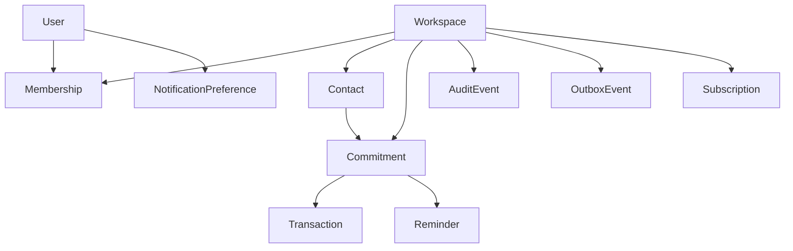

# Modelo de dominio

## Mapa



## Agregados principales

### Identity

`User` y `Session` forman el núcleo de identidad. Los tokens de verificación y recuperación son auxiliares de seguridad.

### Workspace

`Workspace` es la frontera de propiedad. `Membership` expresa acceso humano.

### Contact

`Contact` identifica a la contraparte; no contiene el saldo.

### Commitment

`Commitment` contiene el monto original, saldo materializado, dirección, vencimiento y ciclo de vida. Es el agregado financiero principal.

### Transaction

`Transaction` explica cada cambio de saldo. En Core v0.1, únicamente `payment` y `reversal`.

## Relación conceptual

```text
Quién soy       → User
Dónde opero     → Workspace
Con quién       → Contact
Qué se debe     → Commitment
Qué ocurrió     → Transaction
Quién lo hizo   → AuditEvent
Qué procesar    → OutboxEvent
```

## Principio de trazabilidad

Para cualquier saldo debe poder responderse:

1. ¿Cuál fue el monto original?
2. ¿Qué movimientos lo modificaron?
3. ¿Cuáles fueron revertidos?
4. ¿Cuál es el saldo actual?
5. ¿Quién registró cada operación?
6. ¿La obligación está abierta, pagada o cancelada?

Si una cifra no puede explicarse con esa cadena, el diseño está roto.
