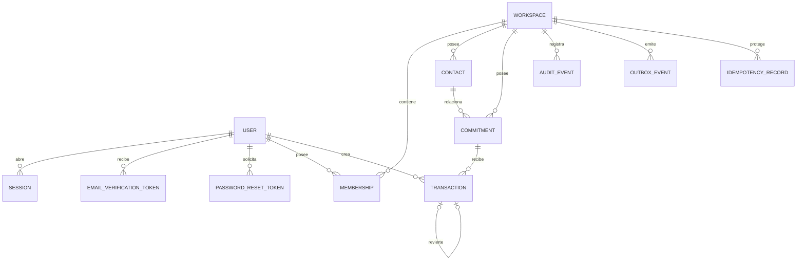
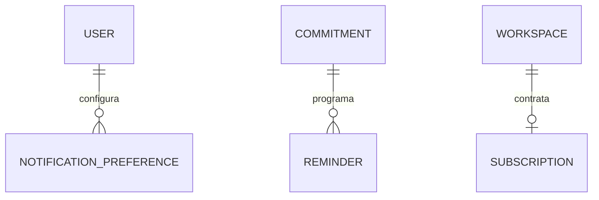

# ERD completo — Core y extensiones

## Core v0.1

## Extensión MVP

## Contexto de cada entidad

| Entidad | Propietario lógico | Función |
|---|---|---|
| User | plataforma | identidad |
| Session | User | sesión revocable |
| EmailVerificationToken | User | verificar correo |
| PasswordResetToken | User | recuperación |
| Workspace | plataforma/User owner | frontera de datos |
| Membership | User + Workspace | acceso |
| Contact | Workspace | contraparte |
| Commitment | Workspace | obligación |
| Transaction | Commitment | cambio de saldo |
| AuditEvent | Workspace | trazabilidad |
| OutboxEvent | Workspace | efectos asíncronos |
| IdempotencyRecord | Workspace | deduplicación |
| Reminder | Commitment | aviso |
| NotificationPreference | User | preferencias |
| Subscription | Workspace | plan |

## Cardinalidades clave

### User — Membership — Workspace

N:M preparada para futuro, aunque Core use 1:1 práctico.

### Workspace — Contact

1:N.

### Contact — Commitment

1:N.

### Workspace — Commitment

1:N redundante intencional para aislamiento y consultas rápidas.

### Commitment — Transaction

1:N.

### Transaction — Transaction

Reversal autorreferenciado 0..1 → 1. `reversal_of_transaction_id` es UNIQUE, por lo que un Payment no tiene más de una reversión.

### Workspace — Subscription

0..1 en diseño inicial.
