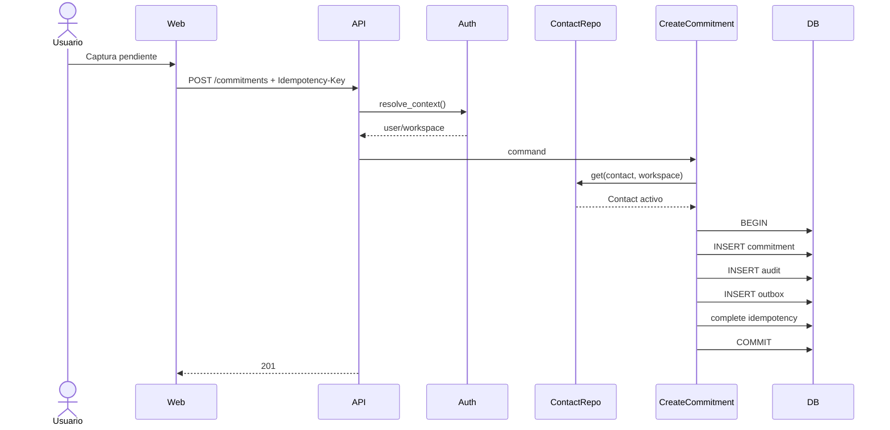
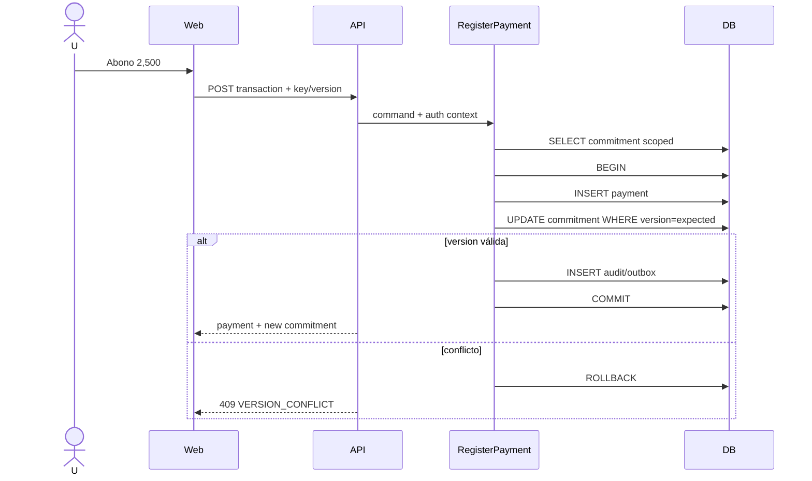
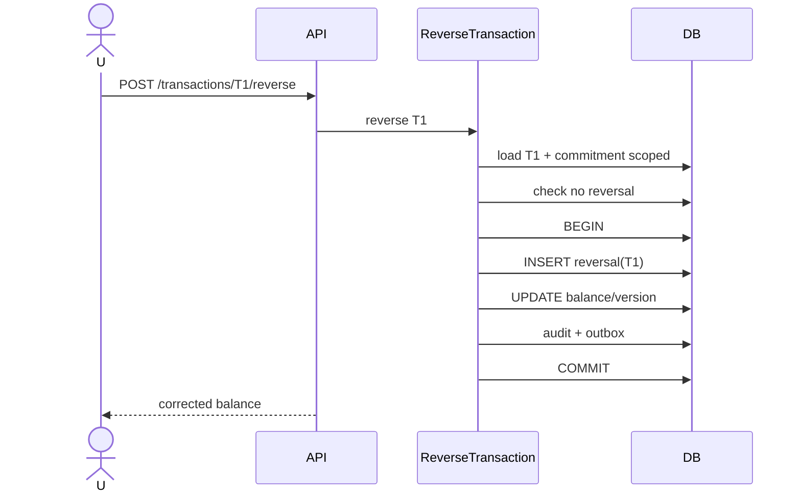

# Diagramas de secuencia

## Crear primer compromiso

```mermaid
sequenceDiagram
    actor U as Usuario
    participant Web
    participant API
    participant Auth
    participant ContactRepo
    participant App as CreateCommitment
    participant DB

    U->>Web: Captura pendiente
    Web->>API: POST /commitments + Idempotency-Key
    API->>Auth: resolve_context()
    Auth-->>API: user/workspace
    API->>App: command
    App->>ContactRepo: get(contact, workspace)
    ContactRepo-->>App: Contact activo
    App->>DB: BEGIN
    App->>DB: INSERT commitment
    App->>DB: INSERT audit
    App->>DB: INSERT outbox
    App->>DB: complete idempotency
    App->>DB: COMMIT
    API-->>Web: 201
```

## Registrar pago

```mermaid
sequenceDiagram
    actor U
    participant Web
    participant API
    participant App as RegisterPayment
    participant DB

    U->>Web: Abono 2,500
    Web->>API: POST transaction + key/version
    API->>App: command + auth context
    App->>DB: SELECT commitment scoped
    App->>DB: BEGIN
    App->>DB: INSERT payment
    App->>DB: UPDATE commitment WHERE version=expected
    alt version válida
      App->>DB: INSERT audit/outbox
      App->>DB: COMMIT
      API-->>Web: payment + new commitment
    else conflicto
      App->>DB: ROLLBACK
      API-->>Web: 409 VERSION_CONFLICT
    end
```

## Reversión

```mermaid
sequenceDiagram
    actor U
    participant API
    participant App as ReverseTransaction
    participant DB

    U->>API: POST /transactions/T1/reverse
    API->>App: reverse T1
    App->>DB: load T1 + commitment scoped
    App->>DB: check no reversal
    App->>DB: BEGIN
    App->>DB: INSERT reversal(T1)
    App->>DB: UPDATE balance/version
    App->>DB: audit + outbox
    App->>DB: COMMIT
    API-->>U: corrected balance
```
