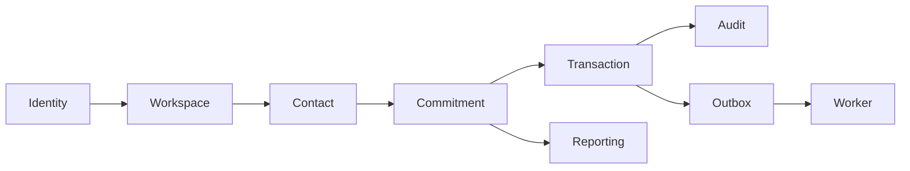

# Flujo end-to-end — Nomi Core v0.1

Este documento une todos los módulos en una sola historia.

## 1. Registro

David crea una cuenta.

Se crean:

```text
User U1
Workspace W1
Membership M1 owner
Session S1
```

El Dashboard está vacío.

## 2. Contacto

David registra:

```text
Contact C1
name = Juan Pérez
workspace = W1
```

Todavía no cambia ningún saldo.

## 3. Compromiso

David registra:

```text
Juan me debe 10,000 MXN
```

Nomi crea:

```text
Commitment K1
direction = receivable
original = 1000000
balance = 1000000
lifecycle = open
version = 1
```

Y genera Audit + Outbox.

Dashboard:

```text
Por cobrar = 10,000
```

## 4. Abono

Juan paga 2,500.

Se crea:

```text
Transaction T1
type = payment
amount = 250000
```

K1 queda:

```text
balance = 750000
version = 2
payment_state = partial
```

Dashboard deriva 7,500.

## 5. Error de captura

David descubre que T1 no debía existir.

No edita T1. Solicita reversal.

```text
T2
type = reversal
amount = 250000
reversal_of = T1
```

K1 vuelve a 10,000 y version 3.

## 6. Pago completo

Posteriormente registra Payment 10,000.

K1:

```text
balance = 0
lifecycle = paid
```

Dashboard deja de incluirlo.

## 7. Historial

Nomi puede explicar:

```text
Commitment creado     10,000
Payment                2,500
Reversal               2,500
Payment               10,000
Estado actual            paid
```

No existe una modificación invisible del saldo.

## Comunicación de módulos



La integración es deliberada: cada módulo aporta su parte sin duplicar responsabilidad.
