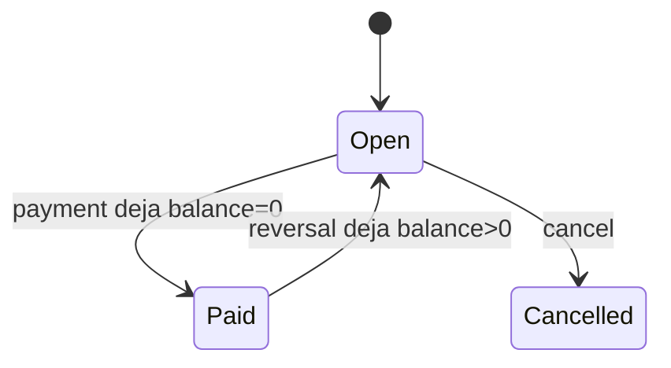
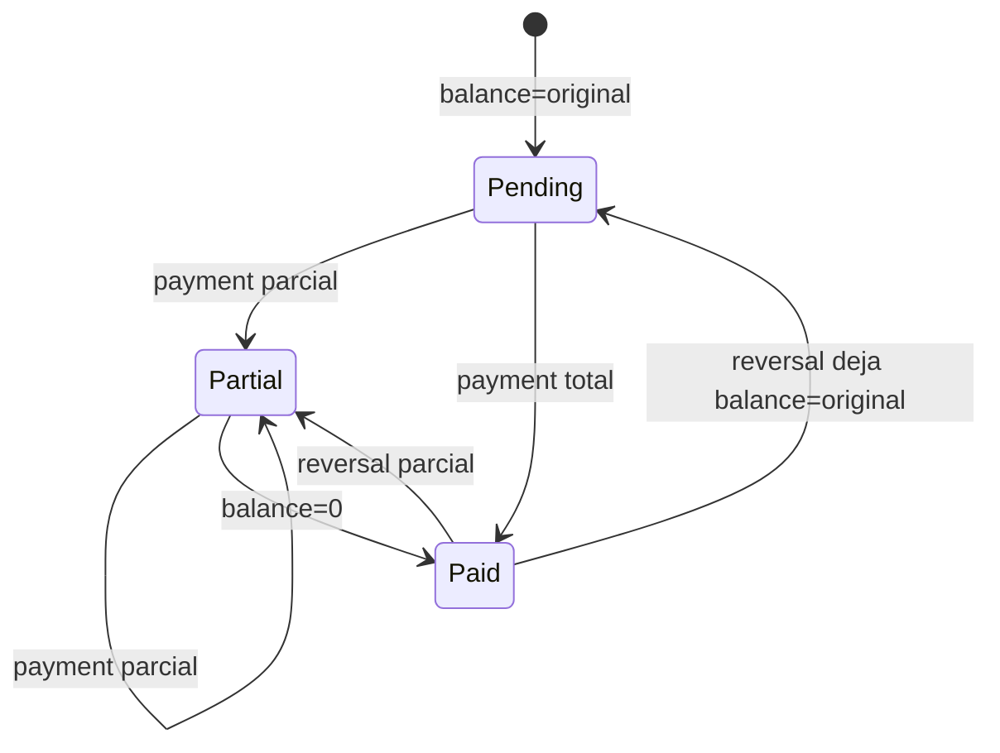
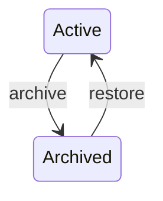
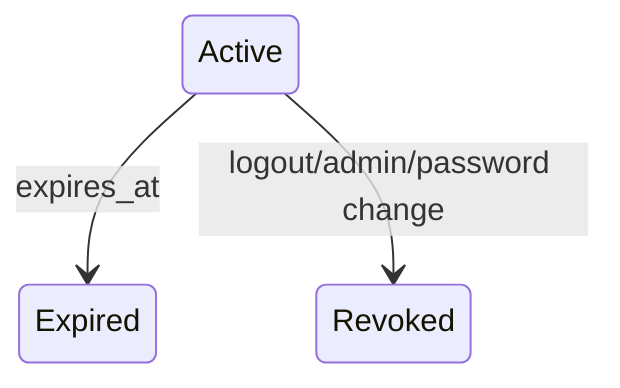
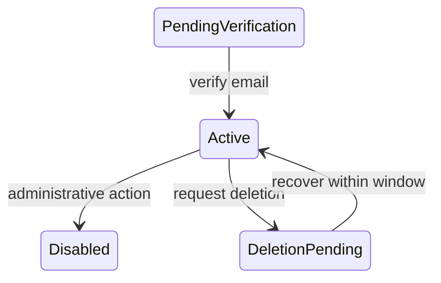

# Máquinas de estado

## Commitment lifecycle



Core no soporta `Cancelled → Open` todavía.

## Payment state derivado



No se persiste como máquina independiente; se calcula desde balance/original.

## Timing state derivado

```text
due_date = null                     → no_due_date
due_date > today + 7                → upcoming
today <= due_date <= today + 7      → due_soon
due_date < today && balance > 0
&& lifecycle=open                   → overdue
```

## Contact archive



Archivo no toca historia financiera.

## Session



## User


