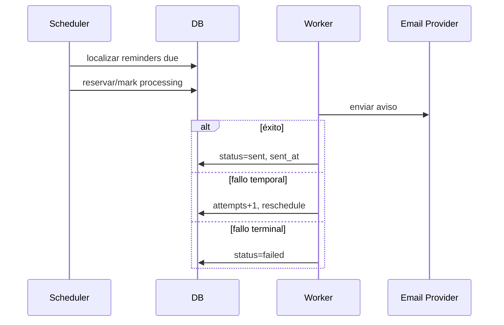

# Flujos posteriores a Core — Reminder y Export

## Reminder

Un CommitmentFullyPaid puede cancelar reminders futuros.

## Export CSV

Flujo:

1. usuario solicita exportación;
2. authorization/workspace;
3. crear job;
4. worker genera CSV;
5. almacenamiento temporal si hace falta;
6. URL firmada corta;
7. expiración/borrado.

Nunca generar una exportación gigante síncronamente si bloquea API.

## Offline

Export y procesamiento de reminders son funcionalidades de servidor; no se prometen offline.
