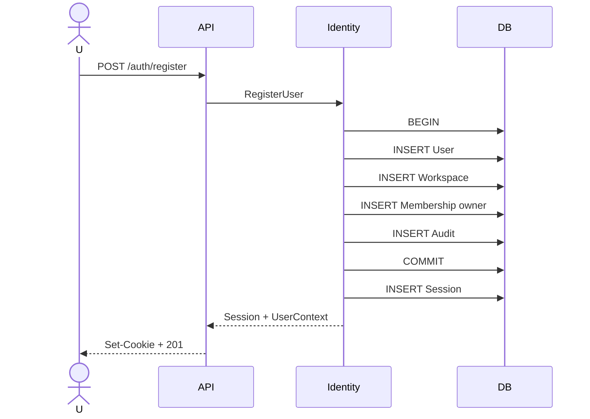

# UC-001 — RegisterUser

## Actor

Persona no autenticada.

## Objetivo

Crear una cuenta lista para operar en Nomi sin exigir configurar manualmente una organización.

## Entrada

```json
{
  "display_name": "David",
  "email": "david@example.com",
  "password": "<secret>"
}
```

## Precondiciones

- email sintácticamente válido;
- email normalizado no ocupado;
- contraseña cumple política;
- servicio de base disponible.

## Flujo principal

1. Normalizar email.
2. Validar payload.
3. Hashear contraseña con Argon2id.
4. Iniciar transacción.
5. Insertar User.
6. Insertar Workspace personal con moneda inicial y timezone.
7. Insertar Membership `owner`.
8. Insertar AuditEvent de registro.
9. Commit.
10. Crear Session.
11. Establecer cookie segura.
12. Crear/encolar verificación de correo.
13. Responder perfil y contexto inicial.



## Atomicidad

User + Workspace + Membership son una unidad lógica. Si cualquiera falla, rollback.

## Salida conceptual

```json
{
  "user": {
    "id": "...",
    "display_name": "David",
    "email": "david@example.com",
    "email_verified": false
  },
  "workspace": {
    "id": "...",
    "currency_code": "MXN",
    "timezone": "..."
  },
  "membership": {
    "role": "owner"
  }
}
```

## Errores

- `EMAIL_ALREADY_REGISTERED`
- `INVALID_EMAIL`
- `INVALID_PASSWORD`
- `REGISTRATION_FAILED`

## Seguridad

- no loggear password;
- UNIQUE de DB para email;
- el mensaje de registro puede indicar duplicado porque el usuario está intentando crear una cuenta; recuperación usa mensajes no enumerables;
- rate limit.

## Pruebas

- crea exactamente las tres entidades;
- rollback si falla Workspace;
- email case-normalized;
- dos registros concurrentes con mismo email generan una sola cuenta;
- cookie segura se configura.
