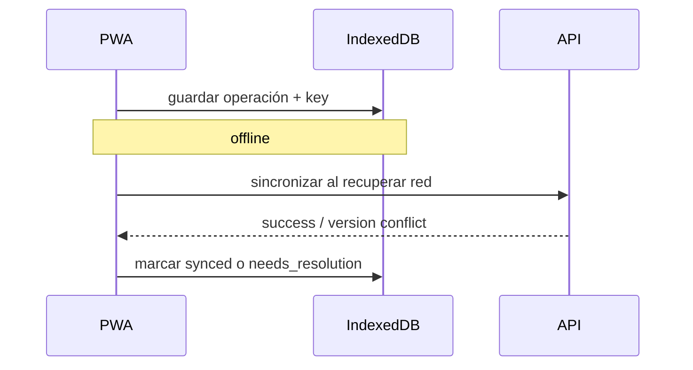

# Offline y sincronización

## Objetivo

Tolerar conectividad inestable sin prometer consistencia mágica.

## Etapas

### Etapa 1 — online sólido

Core debe funcionar correctamente online antes de añadir writes offline.

### Etapa 2 — lectura offline

Cache de datos recientes en IndexedDB.

### Etapa 3 — Contact/Commitment offline

Operaciones locales con UUID e idempotency key.

### Etapa 4 — Payment offline

Sólo después de validar conflictos y UX.

## Operación local

```text
PendingOperation
id
operation_type
entity_id
payload
idempotency_key
expected_version?
created_at
sync_status
attempts
last_error?
```

## Sincronización



## Conflictos

### No financieros simples

Puede considerarse fusión por campo o última escritura con aviso.

### Financieros

Nunca sobrescribir silenciosamente.

Si version cambió:

- detener esa operación;
- obtener estado servidor;
- mostrar resolución;
- usuario reconfirma.

## Duplicación

Idempotency key protege reintentos.

## Eliminación concurrente

Bloquear operación y mostrar estado actual; no recrear silenciosamente recursos borrados/archivados.

## UX

Toda operación local muestra estado:

- guardado localmente;
- pendiente de sincronizar;
- sincronizado;
- requiere atención.
