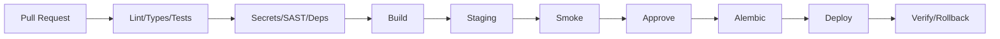

# DevOps y despliegue

## Ambientes

- local;
- preview opcional;
- staging con datos sintéticos;
- producción.

Nunca copiar producción a staging.

## Pipeline

## Docker

Entornos reproducibles; contenedores sin privilegios cuando sea posible.

## Redis

No desplegar por arquitectura decorativa. Añadir sólo al demostrarse necesidad de:

- cola distribuida;
- cache;
- rate limiting distribuido.

## Deploy inicial

Frontend + API + PostgreSQL administrado. Worker se incorpora cuando recordatorios/outbox lo requieran operacionalmente.

## Health

- `/health/live`: proceso vivo;
- `/health/ready`: dependencias críticas listas.

## Rollback

- conservar imagen previa;
- feature flags en cambios riesgosos;
- evitar migraciones destructivas inseparables;
- preferir forward-fix para datos.
