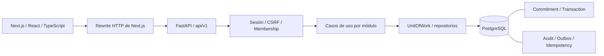

# Nomi — Architecture & Reconstruction Brief

Fecha: 2026-10-06. Estado: diagnóstico y propuesta para revisión; no modifica decisiones aceptadas.

Este diagnóstico es la línea base anterior a la implementación. La reconstrucción posterior
se registra en [ADR-0020](adr/0020-core-reconstruction-contracts.md) y en el
[estado actualizado](IMPLEMENTATION_STATUS.md); las ausencias y riesgos siguientes describen
el momento de inspección, no el estado vigente tras esas correcciones.

## 1. Dictamen

Nomi tiene una primera vertical online funcional, construida sobre el stack y las fronteras principales acordadas. Conviene conservar y completar esa base. No hay evidencia que justifique sustituir PostgreSQL, FastAPI, Next.js o el monolito modular.

El recorrido prioritario todavía está incompleto:

**RegisterUser → CreateContact → CreateCommitment → RegisterPayment → ReversePayment → GetDashboardSummary.**

La brecha principal es ReversePayment: la base tiene soporte estructural, pero no existen operación de dominio, caso de uso, endpoint, UI ni pruebas de reversión. Además, deben cerrarse continuidad idempotente y precisión de agregados antes de considerar el recorrido confiable frente a fallos.

Mobile, AdMob y Play Billing quedan fuera de ejecución hasta superar las puertas de calidad del [plan incremental](../RECONSTRUCTION_PLAN.md). La UI azul tinta/lavanda se conserva como base.

## 2. Fuentes y límites del análisis

Fuentes contrastadas:

- `AGENTS.md`, `README.md`, `DOC_INDEX.md` y `TRACEABILITY.md` de la raíz.
- Skill suministrado: `C:/Users/AUMD040320/Downloads/SKILL_NOMI_PRODUCT_MOBILE_MONETIZATION.md`. Se leyó desde Descargas; no se copió ni instaló.
- Memoria `NOMI_MEMORIA_TECNICA_v0.1/`: producto, arquitectura, dominio, datos, API/seguridad, UX/offline, operación y roadmap; especialmente UC-001–008 y ADR-0001–0018.
- [ADR-0019 provisional](adr/0019-first-slice-contracts.md), [estado de implementación](IMPLEMENTATION_STATUS.md) y [revisión de UI](UI_REWORK_AND_REVIEW.md).
- Contrato real [OpenAPI JSON](api/openapi.json). El YAML mencionado por el skill no existe; esa diferencia de formato no implica ausencia de contrato.
- Código de API y web, migración inicial, pruebas, dependencias, Compose y workflow de CI.

La inspección corresponde al árbol de trabajo actual, que contiene cambios previos sin registrar y archivos nuevos. No se descartaron, consolidaron ni modificaron esos cambios. La presente tarea crea únicamente documentación.

La evidencia anterior de esta conversación es: 44 pruebas de backend aprobadas, 2 E2E en escritorio/móvil aprobados, build y TypeScript aprobados, y Alembic sin diferencias de esquema. Los E2E se repitieron después del rediseño. **No se ejecutaron nuevas pruebas ni se alteraron bases de datos para este brief.** No hay evidencia de CI remoto, staging, restore o auditoría exhaustiva de seguridad/accesibilidad. Los riesgos por inspección no se presentan como incidentes explotados.

## 3. Arquitectura actual

No hay worker operativo, consumidor outbox, cliente Android, integración publicitaria ni billing. Compose ejecuta PostgreSQL; API y web se inician como procesos locales, no como un despliegue completo contenedorizado.

| Capa | Estado real |
| --- | --- |
| Web | Next.js App Router, React, TypeScript, Tailwind, TanStack Query, React Hook Form y Zod. CSS y UI mobile-first. |
| API | FastAPI, schemas Pydantic, Problem Details y UUID. OpenAPI con 12 operaciones de negocio y 2 de salud. |
| Aplicación | Casos de uso de escritura y UnitOfWork; algunas lecturas y logout acceden al UoW desde routers. |
| Dominio | Entidad Commitment pura e inmutable, validaciones financieras y transición de pago. No hay motor de reversión. |
| Persistencia | SQLAlchemy 2, PostgreSQL, Alembic y una migración inicial. |
| Seguridad | Argon2id, sesión opaca hasheada, cookie HttpOnly, SameSite, CSRF, comprobación de origen y alcance por Workspace. |
| Operación | CI configurado, health endpoints y spans OpenTelemetry API. Faltan pipeline de despliegue y exportación de telemetría. |

### Módulos y responsabilidades

| Módulo | Propiedad | Implementado / pendiente |
| --- | --- | --- |
| identity | User y Session | Registro, login/logout y perfil; faltan reset, verificación y lifecycle de cuenta. |
| workspaces | Workspace y Membership | Creación personal y resolución de OWNER; no implementar equipos. |
| contacts | Contact | Crear/listar y consulta de contacto activo; faltan edición, detalle, archivo/restauración y resumen. |
| commitments | Commitment, invariantes y consulta agregada | Crear/listar/detalle/pago de dominio; faltan transición de reversión y cancelación. |
| transactions | Transaction | Registrar payment e historial; reversal no implementado. |
| audit | AuditEvent | Registro dentro de transacciones de negocio; falta política operativa de consulta/retención. |
| reporting | Proyecciones | Resumen derivado mediante consulta propiedad de Commitments; no escribe saldos. |
| reminders / billing | Trabajo asíncrono / derechos comerciales | No implementados; no deben introducirse como módulos vacíos por anticipación. |

Los módulos existentes se distribuyen en `domain/`, `application/`, `infrastructure/` y `api/` según tengan código que alojar. `shared/uow.py` compone los repositorios, lo cual es compatible con compartir una transacción. Su contrato usa `Any` para todos los repositorios: la frontera existe, pero el tipado no protege sus interfaces.

## 4. Entidades, migraciones e invariantes

Cadena de propiedad: **User → Membership → Workspace → Contact → Commitment → Transaction**. La transacción financiera pertenece al Workspace a través del Commitment; no necesita un `workspace_id` duplicado para ser autorizada.

La migración `8c328338b737_core_vertical_slice` crea diez tablas:

| Entidad | Observación |
| --- | --- |
| User | Email único y hash de contraseña; faltan `email_verified_at` y `updated_at`. |
| Session | Hash de sesión y CSRF, expiración y revocación. |
| Workspace | Moneda y timezone; falta `updated_at`. |
| Membership | Vínculo usuario/workspace y rol; registro crea OWNER. |
| Contact | Sin unicidad artificial de nombre/email/teléfono; faltan notas y `updated_at`. |
| Commitment | BIGINT, dirección, saldo, ciclo, versión, fechas y soft delete; faltan notas. |
| Transaction | Monto positivo, tipo y self-FK UNIQUE para reversión. |
| IdempotencyRecord | Unicidad por workspace/operación/clave; hash y snapshot JSONB provisional. |
| AuditEvent | Acción, actor y recurso; separado de logs de aplicación. |
| OutboxEvent | Evento durable y estado de procesamiento; aún sin consumidor. |

Protecciones observadas:

- Original positivo; saldo entero entre cero y original; versión positiva.
- OPEN requiere saldo positivo y PAID saldo cero; CANCELLED conserva saldo y sale de agregados activos.
- Estados temporales/de pago derivados; moneda validada al crear y derivada del compromiso al pagar.
- Pagos positivos y rechazo de sobrepago; actualización condicional por versión y Workspace.
- Pago, saldo, auditoría, outbox y respuesta idempotente dentro del mismo commit.
- Autorización antes del replay; deduplicación antes de validar la versión actual para devolver el resultado original tras cambios posteriores.
- FK financieras RESTRICT; self-FK UNIQUE preparada para impedir doble reversión.

Límites: los CHECK locales no prueban por sí solos igualdad de moneda entre entidades, misma pertenencia de Contact/Commitment o monto correcto de una reversión. Esas invariantes dependen también de aplicación. La FK no reemplaza el caso de uso ReversePayment. Tampoco hay inmutabilidad absoluta frente a un administrador SQL: actualmente se protege mediante los caminos de aplicación expuestos.

El downgrade inicial elimina las tablas. Es una reversión destructiva de esquema, no un procedimiento seguro de recuperación de datos. No ejecutarlo sobre una base con datos como parte de esta reconstrucción. Las ampliaciones deberán tener nuevas migraciones y estrategia forward-fix; no reescribir la migración existente para ocultar cambios.

## 5. Contrato API e integración

Operaciones presentes bajo `/api/v1`:

- POST `auth/register`, `auth/login`, `auth/logout`; GET `me`.
- GET/POST `contacts`.
- GET/POST `commitments`; GET `commitments/{commitment_id}`.
- GET/POST `commitments/{commitment_id}/transactions`.
- GET `dashboard/summary`.

El cliente TypeScript se genera desde OpenAPI. Crear compromiso y registrar pago requieren Idempotency-Key. Payment exige `expected_version` y fecha con timezone. Los routers no exponen importes modificables de movimientos existentes.

Ausencias relevantes: `POST /transactions/{transaction_id}/reverse`, reset/verificación, edición/eliminación de cuenta, detalle/edición/archivo de contactos, resumen por contacto y operaciones controladas de compromiso. El DTO `TransactionOut` no expone `reversal_of_transaction_id`: habrá que ampliarlo para que la UI explique qué pago corrige una reversión. La semántica DELETE/archivo/cancelación necesita un contrato explícito antes de crear esos endpoints.

## 6. Clasificación

Se clasifica cada aspecto, no se etiqueta todo el sistema con una sola categoría. «Correcto» significa alineado dentro de la vertical implementada; no equivale a listo para producción. «Inseguro» señala un escenario concreto de riesgo de integridad o exposición.

### Correcto

| ID | Evidencia | Decisión respaldada |
| --- | --- | --- |
| C01 | Stack, monorepo y módulos separados | ADR-0001–0004 y 0010. |
| C02 | BIGINT y CHECK financieros en migración; Commitment valida tipos y estados | ADR-0009, 0011 en PostgreSQL y 0013. |
| C03 | `api/security.py` resuelve Membership; repositorios filtran Workspace | ADR-0017; pruebas negativas existentes. |
| C04 | `transactions/application/use_cases.py` y `shared/uow.py` confirman efectos juntos | Atomicidad y ADR-0006. |
| C05 | Reserva única, hash, replay y CAS de versión | ADR-0014 y 0016. |
| C06 | Dashboard consulta compromisos activos sin tabla de totales | ADR-0018. |
| C07 | Cookies/CSRF, hash de credenciales y errores sin reflejar entradas | Requisitos web de autenticación y privacidad, con límites indicados abajo. |

### Incompleto

| ID | Hallazgo | Impacto |
| --- | --- | --- |
| I01 | ReversePayment sólo tiene preparación SQL | Bloquea la vertical solicitada y la corrección de pagos erróneos. |
| I02 | Campos auxiliares y lifecycle de contactos/compromisos ausentes | Esquema y API cubren una slice, no todo Core. |
| I03 | Recuperación/verificación y revocación tras password change ausentes | Ciclo de cuenta incompleto. |
| I04 | Outbox sin consumidor y telemetría sin proveedor/exportador | Intención durable sin ejecución; visibilidad operativa insuficiente. |
| I05 | Búsqueda/filtros locales; contactos cargados por separado; historial paginado por UUID | Consultas parciales y cronología discontinua entre páginas. |
| I06 | Puertos `Any` y pantalla principal concentrada en `page.tsx` | Menor verificación estática y mayor coste de evolución. |
| I07 | PWA/offline, exportación, restore, staging y revisión de accesibilidad pendientes | No se cumple Definition of Done de lanzamiento. |
| I08 | Readiness ejecuta SELECT 1; CI remoto no acreditado | Conectar a DB no prueba que el esquema esté listo ni que el despliegue funcione. |

### Desactualizado

| ID | Hallazgo | Corrección documental propuesta |
| --- | --- | --- |
| D01 | Roadmap/criterio de la primera slice anterior termina en pago/dashboard | Actualizar el hito para incluir reversión E2E, según la instrucción actual. |
| D02 | El skill remite a `docs/product`, `docs/architecture` y OpenAPI YAML | Enlazar la memoria técnica real y el JSON existente; no duplicar árboles como solución automática. |
| D03 | El índice histórico de ADR termina en 0018 | El índice raíz sí enlaza 0019; consolidar navegación conservando el índice histórico como tal. |
| D04 | Mensaje de red de `lib/api.ts` promete no duplicar abonos para cualquier operación | Sustituir la promesa general por estados/mensajes específicos una vez resuelta continuidad de intención. |

No se califican dependencias como obsoletas sólo por su versión: no se hizo una evaluación de vulnerabilidades ni una actualización de librerías en este análisis.

### Contradictorio

| ID | Diferencia | Resolución propuesta, aún no aplicada |
| --- | --- | --- |
| X01 | Skill y AGENTS tienen jerarquías documentales diferentes | Unificar precedencia; conservar decisiones aceptadas y registrar excepciones explícitas. |
| X02 | UC-006 hace condicional `expected_version`; ADR-0016 lo exige | Hacerlo obligatorio en reversión, coherente con pagos y la decisión aceptada. |
| X03 | Skill cambia a OPEN si hay saldo tras reversal; UC-008 prohíbe reapertura implícita de cancelados | Reabrir PAID; para CANCELLED elegir explícitamente rechazo o conservación del ciclo. Recomendación inicial: rechazo hasta definir una operación posterior. |
| X04 | Skill/UC-001 sitúan sesión después de commit; código y ADR-0019 la incluyen | Recomiendo conservar commit único; revisar y cerrar la decisión provisional sin ocultar la diferencia. |
| X05 | ADR-0011 pide Enum Python; la entidad usa `str` y validaciones manuales | Introducir enums tipados sin cambiar valores serializados en minúsculas. La validación actual evita valores inválidos, por lo que no es una corrupción demostrada. |
| X06 | Docs llaman local al permiso de operar como pending_verification; login/repositorio lo permiten sin condición de ambiente | Definir política por estado y entorno; documentar y probar antes de liberar. |
| X07 | ADR-0013 enumera cuatro timing states; API devuelve además null para cerrados | Resolver el refinamiento provisional de ADR-0019 y sincronizar el contrato. |
| X08 | «Saldo nunca cambia sin Transaction» puede interpretarse incluyendo el saldo inicial | Precisar: CreateCommitment establece saldo original con audit/outbox; modificaciones posteriores se explican con payment/reversal. No inventar un tipo inicial. |

También requieren resolución el nombre ReversePayment frente a ReverseTransaction, la edición del monto original, y snapshot/retención idempotente. El ejemplo feliz del skill incluye ReversePayment en el título, pero omite su efecto en los pasos: debe terminar en $10,000 después de revertir el abono, no en $7,500.

### Inseguro o riesgoso bajo condiciones concretas

| ID | Prioridad | Escenario y evidencia | Mitigación propuesta |
| --- | --- | --- | --- |
| S01 | P1 | `forms.tsx` mantiene la intención en `useRef`. Un commit con respuesta perdida, seguido de cierre/recarga y nuevo envío con versión actual, puede generar un segundo pago si queda saldo. No falla la deduplicación de una misma clave: se perdió la identidad de la operación. | Conservar intención y resultado incierto de forma durable, scoped a cuenta/workspace, con reconciliación y UX explícita. Probar cierre, recarga, logout/cambio de cuenta y respuesta perdida. |
| S02 | P1 | SUM PostgreSQL no tiene límite equivalente al de cada operación; `response.json()` y `money(number)` pueden perder unidades menores por encima del entero seguro JavaScript. | Decidir serialización exacta y límites del contrato. Probar grandes agregados con diferencias de un centavo antes de escalar. |
| S03 | P1 antes de exposición | Valores por defecto son environment=development y cookie_secure=false; aceptar pending_verification no está limitado al entorno. Copiar configuración local a un despliegue no crea una política de producción segura. | Configuración explícita de despliegue, validación de arranque y política de estados de cuenta. No se afirma que exista un despliegue público afectado. |
| S04 | P2 antes de exposición | Tamaño de request limitado sólo mediante Content-Length; rate limiter por proceso/IP, con posible concentración detrás del proxy | Límite efectivo de cuerpo, pruebas del proxy y controles de abuso apropiados. No confiar libremente en X-Forwarded-For ni añadir Redis sin necesidad. |

No se encontró en los caminos inspeccionados una autorización global por conocer un UUID ni una edición destructiva de pagos. Eso no sustituye una auditoría de seguridad. Las credenciales locales de desarrollo y el cluster trust en loopback no deben confundirse con configuración de producción.

## 7. Estados de decisión

**ACEPTADAS:** monolito/API-first/monorepo; PostgreSQL; FastAPI; Next.js; outbox atómica; OpenTelemetry; dinero BIGINT; ausencia de microservicios; VARCHAR+CHECK con enums Python; moneda única; estados derivados; idempotencia; self-FK UNIQUE; versión optimista; propiedad Workspace y Dashboard derivado. Corresponden a ADR-0001–0004, 0006–0007 y 0009–0018.

**PROVISIONALES:** sesión opaca (0005); contratos de la slice (0019), incluido snapshot y timing null; propuestas Capacitor/AdMob/Play Billing del skill; proveedores concretos. Ninguna se acepta automáticamente mediante este brief. Redis es una posibilidad condicionada a necesidad, no un componente aprobado para añadir.

**PLANIFICADAS:** billing alojado (0008), premium, recurrencias, adjuntos/PDF, equipos/roles e iOS. Offline es una evolución por etapas; no se promete como capacidad actual. Mobile y monetización permanecen fuera del trabajo Core.

## 8. Diseño recomendado para cerrar la vertical

Conservar User/Membership/Workspace, Contact, Commitment, Transaction y efectos transaccionales. Añadir ReversePayment sin un segundo libro de saldos ni un servicio nuevo.

Responsabilidades propuestas:

1. Transactions autoriza el pago original a través de su Commitment dentro del Workspace.
2. Deduplica la intención antes de rechazar por versión o reversión ya realizada; un retry confirmado debe devolver su resultado original.
3. Deriva amount/currency/commitment del pago. No permite revertir una reversal ni dos veces el mismo pago.
4. Commitment aplica la restauración de saldo y la transición PAID → OPEN con expected_version obligatorio.
5. Transactions registra reversal positiva con self-FK; Commitment guarda mediante CAS; Audit, Outbox e Idempotency se confirman juntos.
6. API devuelve un contrato que permite identificar el vínculo original/reversión. Web muestra ambas filas y saldo actualizado.

Invariante a comprobar: **saldo = original − suma(payments) + suma(reversals)**; las reversiones son completas del pago original en Core. La cancelación conserva ese saldo histórico y modifica participación en agregados, no simula un pago.

Pruebas bloqueantes: flujo $10,000 → $7,500 → $10,000; pago total y reapertura; doble reversión; revertir una reversal; Workspace ajeno; versión obsoleta; carreras pago/reversión y reversión/reversión; mismo key/payload; key conflictivo; retry después de cambios posteriores; rollback ante fallos de audit/outbox; historial enlazado; fechas/timezone; política explícita de cancelados.

## 9. Recomendación de reconstrucción

La reconstrucción debe cerrar brechas, no repetir Foundation ni descartar la UI. El primer entregable de implementación será completar y endurecer la vertical, con documentación/contratos aprobados antes de alterar decisiones. El [plan incremental](../RECONSTRUCTION_PLAN.md) establece orden, alcance, pruebas y condición de paso. No iniciar apps/mobile, anuncios, compras, SDK publicitarios ni infraestructura para ellos al cerrar este análisis.
